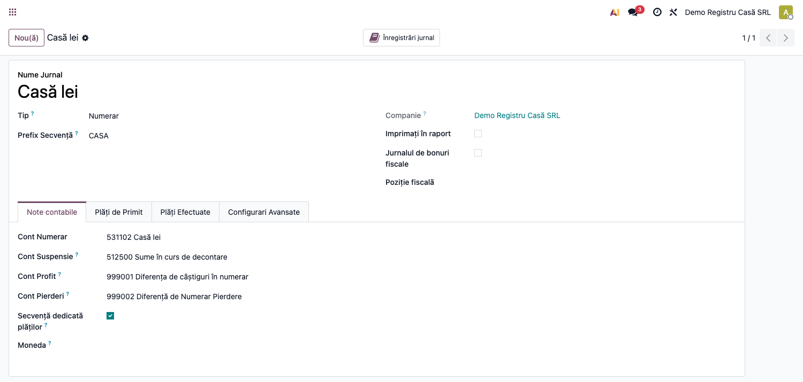
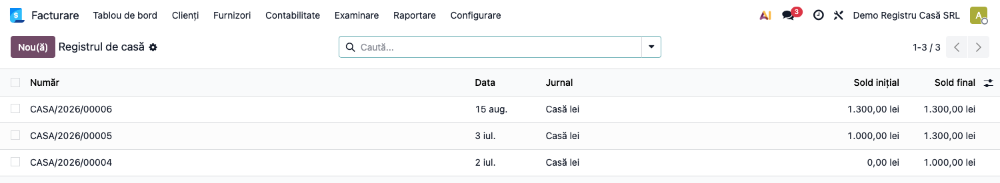
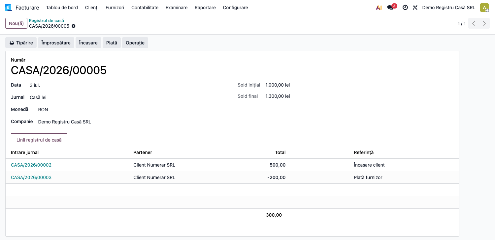
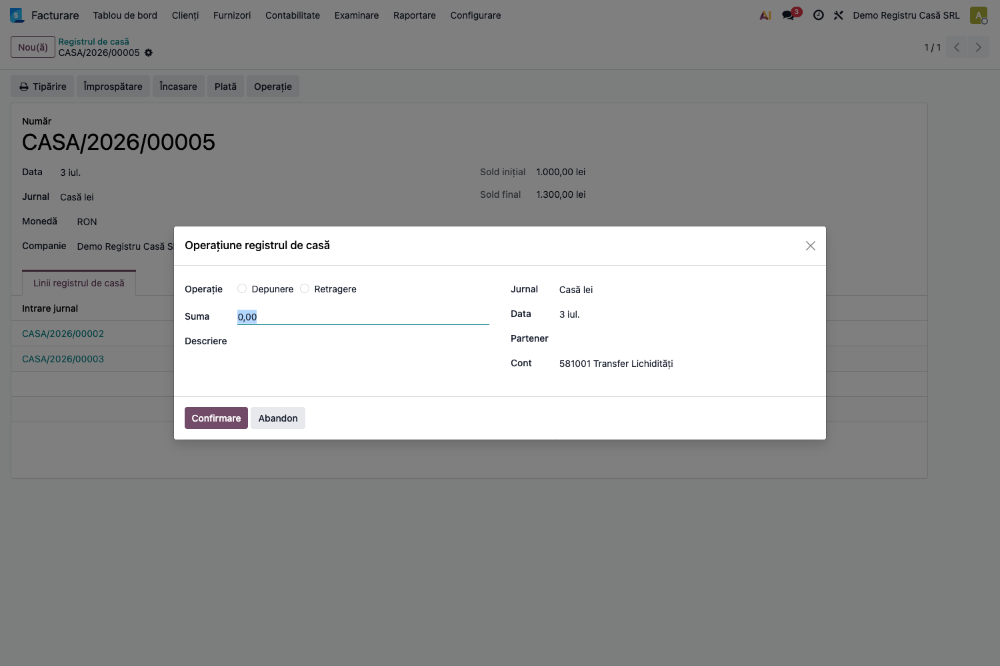
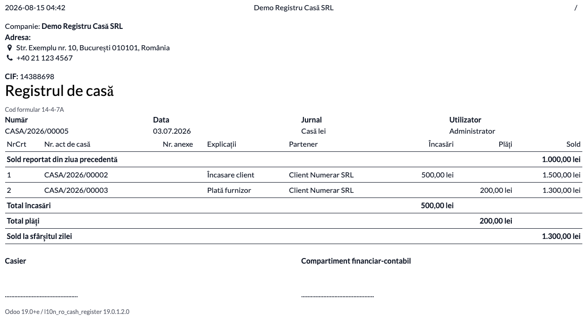

# Fișă Modul: Registru de casă RO

**Poziție plan:** C20  
**Modul:** `l10n_ro_cash_register`  
**Suită:** `l10n-romania`  
**FR:** FR-28  
**Capitol manual:** Cap 8.4  
**Utilizator principal:** Contabil, Casier, Consultant implementare  
**Prioritate:** Ridicată

---

## 1. Scop business

Modulul oferă un registru de casă zilnic pentru jurnalele de tip numerar și leagă operațiunile
de încasare, plată și transfer direct de soldul casei. Consultantul trebuie să îl prezinte ca
soluția operațională pentru partea de **registru casă RO** din FR-28.

Acest modul nu acoperă importul extraselor bancare MT940 și nici reconcilierea bancară automată;
acelea rămân module complementare separate.

## 2. Ce aduce concret modulul

- model nou `l10n.ro.cash.register`;
- un registru pe **zi + jurnal de casă**;
- calcul automat de **sold inițial** și **sold final** din mișcările contabile postate,
  reactualizat la fiecare postare sau anulare de notă pe contul de casă;
- acces rapid la **încasare**, **plată** și **operațiune casă** direct din registru;
- generare automată a registrului de casă la postarea plăților pe jurnal cash;
- acțiune de generare a registrelor lipsă pentru zilele care au mișcări;
- raport PDF tipărit conform formularului **14-4-7A**, cu buton **Tipărire** în formular și listă;
- deschidere directă a registrului de casă din jurnalul cash pentru companiile RO.

## 3. Utilizatori și roluri

- **Casier / contabil casă**: operează încasări, plăți și transferuri în/din casă.
- **Contabil**: verifică soldurile pe zi, tipărește registrul și corelează cu notele contabile.
- **Consultant implementare**: configurează jurnalul de numerar, contul de transfer și explică
  diferența dintre fluxul de casă și fluxul bancar.

## 4. Configurare inițială

### Pasul 1 — Instalare

1. Instalați `l10n_ro_account_sequence`.
2. Instalați `l10n_ro_cash_register`.

### Pasul 2 — Configurare jurnal de casă

În jurnalul de tip **cash** verificați:

- compania este în România;
- există contul implicit de lichiditate pe jurnal;
- codul jurnalului este corect, fiind folosit și în secvența registrului;
- compania are configurat `transfer_account_id`, deoarece wizardul de operațiune îl folosește
  implicit ca și cont corespondent.

### Pasul 3 — Acces utilizator

Utilizatorii contabili pot deschide registrul din meniul de tranzacții contabile sau direct din
jurnalul de casă.

## 5. Unde se găsește în interfață

- **Contabilitate → Tranzacții → Registrul de casă**
- direct din jurnalul cash, deoarece dashboard-ul jurnalului redirecționează către registrul de
  casă pentru companiile RO

Jurnalul de casă (din care se accesează registrul):



Lista registrelor de casă (un registru pe zi, cu sold inițial și calculat):



## 6. Flux de lucru

### Pasul 1 — Crearea registrului zilnic

Pentru fiecare combinație **jurnal de casă + dată** există un singur registru. Modulul impune
unicitatea și generează numărul registrului cu secvență derivată din codul jurnalului.

### Pasul 2 — Alimentarea registrului cu mișcări

Registrul preia liniile contabile postate de pe contul implicit al jurnalului cash, pentru ziua
selectată. Din ele rezultă:

- **Sold inițial** = suma mișcărilor postate anterioare zilei, adică soldul de închidere al
  zilei precedente;
- **Sold final** = suma mișcărilor postate până la ziua curentă inclusiv.

Soldurile se recalculează **automat** la postarea, anularea sau ștergerea unei note care atinge
contul de casă — pentru ziua respectivă și pentru toate zilele ulterioare din același jurnal,
pentru că reportul se propagă în lanț. Butonul **Împrospătare** rămâne disponibil pentru
recalculul manual, dar nu mai este necesar în operarea curentă.

### Pasul 3 — Operare din registru

Din formularul registrului (butoanele **Tipărire / Împrospătare / Încasare / Plată / Operație**)
sunt disponibile trei acțiuni de operare:



1. **Încasare (Add Receipt)** — deschide fluxul de încasare pe jurnalul și data registrului.
2. **Plată (Add Payment)** — deschide fluxul de plată pe jurnalul și data registrului.
3. **Operație (Operation)** — deschide wizardul de operațiune casă.



Wizardul de operațiune casă permite:

- **Cash In**
- **Cash Out**

La confirmare, wizardul generează și postează automat o notă contabilă cu două linii:

- contul de casă al jurnalului;
- contul corespondent selectat.

Tipul documentului contabil este setat pe `other`.

### Pasul 4 — Generare automată a registrelor lipsă

La postarea unei plăți pe jurnal cash, modulul verifică dacă există registru pentru ziua
respectivă și îl creează dacă lipsește.

În plus, jurnalul are acțiunea **Generate Missing Cash Register**, care creează registre pentru
toate datele cu mișcări contabile postate pe contul de casă și, separat, pentru ziua curentă.

Există și un cron pregătit pentru această generare, dar este livrat **inactiv**.

### Pasul 5 — Tipărirea registrului

Tipărirea se face din butonul **Tipărire** din bara formularului sau, pentru mai multe registre
deodată, selectându-le în listă. Raportul urmează formularul **Registru de casă, cod 14-4-7A**:

- date companie, CIF și NRC;
- **Sold reportat din ziua precedentă**;
- liniile zilei, în ordine cronologică: nr. act de casă, nr. anexe, explicații, partener,
  încasări, plăți și sold cumulat;
- **Total încasări**, **Total plăți** și **Sold la sfârșitul zilei**, pe rânduri distincte;
- rubrici de semnătură pentru casier și pentru compartimentul financiar-contabil;
- mențiunea programului informatic și a versiunii, cerută pe orice listare de OMFP 2634/2015,
  Anexa 1 pct. 58 lit. k).

Coloana **Nr. anexe** afișează numărul de atașamente ale notei contabile — echivalentul digital
al documentelor justificative anexate actului de casă.

Listarea pe hârtie nu este obligatorie zilnic: obligatorie este **întocmirea** zilnică, iar
documentele se pot păstra electronic cu condiția de a putea fi listate în orice moment
(Anexa 1 pct. 12, 36 și 56).



## 7. Reguli funcționale importante

| Situație | Comportament |
|---|---|
| Jurnalul nu este de tip cash | modulul nu se aplică |
| Compania RO deschide jurnal cash | jurnalul deschide registrul de casă, nu fluxul generic |
| Plată postată pe jurnal cash | registrul zilei se creează automat dacă lipsește |
| Există mișcări istorice fără registre | acțiunea de generare creează registrele lipsă |
| Există deja registru pe aceeași zi și jurnal | nu se poate duplica |
| Acțiuni din registru | jurnalul și data sunt precompletate în context |

## 8. Scenarii de test pentru consultant

| ID | Scenariu | Rezultat așteptat |
|---|---|---|
| CR-01 | Creezi un jurnal cash nou și un registru pe o zi | registrul primește număr cu prefixul codului jurnalului |
| CR-02 | Postezi o încasare cash în ziua registrului | registrul zilei există și include mișcarea |
| CR-03 | Postezi o plată cash într-o zi fără registru | registrul se creează automat |
| CR-04 | Rulezi Generate Missing Cash Register pe jurnal | se creează registre pe toate datele cu mișcări |
| CR-05 | Faci Cash In din wizard | se postează nota contabilă cu debit pe contul de casă |
| CR-06 | Faci Cash Out din wizard | se postează nota contabilă cu credit pe contul de casă |
| CR-07 | Postezi o mișcare într-o zi anterioară | soldurile zilei și ale tuturor zilelor următoare se actualizează singure |
| CR-08 | Anulezi o notă postată de casă | soldurile revin la valoarea corectă, fără Împrospătare |
| CR-09 | Tipărești raportul din butonul Tipărire | apare registrul 14-4-7A cu report, totaluri și sold final |
| CR-10 | Verifici soldul de deschidere al unei zile | este identic cu soldul de închidere al zilei precedente |

## 9. Legături cu alte module

| Modul | Rol |
|---|---|
| `l10n_ro_account_sequence` | secvențe localizate pentru numerotarea registrului |
| `account` | jurnale, plăți, note contabile |
| `l10n_ro_account_bank_statement_import_mt940_base` | bază pentru import extras bancar MT940, complementar FR-28 |
| `l10n_ro_account_bank_statement_import_mt940_bcr` / `..._ing` / alte bănci | adaptoare de bancă pentru importul extraselor, în afara acestui modul |

## 10. Limitări și gap-uri cunoscute

| Limitare | Impact |
|---|---|
| Modulul acoperă doar registrul de casă, nu și fluxul bancar | FR-28 rămâne doar parțial acoperit |
| Nu include import MT940 și reconciliere automată | partea de bancă rămâne în backlog / module complementare |
| Nu implementează explicit controalele de plafoane numerar Legea 70/2015 | consultantul nu trebuie să o vândă ca soluție de compliance complet pe plafoane |
| Butonul de print pe linie există în view, dar metoda `print_cash_operation` este goală și butonul este ascuns | nu există tipărire individuală a operațiunii din linie |
| Cronul de generare registre lipsă este inactiv la livrare | dacă se dorește automatizare zilnică, trebuie activat explicit |
| Soldurile se calculează pe contul implicit al jurnalului, nu pe jurnal | două casierii care partajează același cont 5311 se contaminează reciproc; configurează un cont analitic distinct per casierie |

## 11. Mesaje-cheie pentru consultant

- Modulul este bun pentru **registrul de casă zilnic** și pentru operarea controlată a numerarului.
- Pentru **extrase bancare MT940** și reconciliere, proiectul are nevoie de modulele dedicate de
  import bancar.
- Pentru **plafoane legale de numerar**, sunt necesare reguli suplimentare față de ce există acum.

## 12. Capturi de ecran

Capturile (`readme/screenshots/`) sunt **generate automat** din `tests/test_screenshots.py`
(mixinul `ScreenshotCase` din `l10n_ro_doc_screenshots`, import defensiv), în **limba română**,
pe un jurnal de casă seedat cu câteva operațiuni (sold inițial + încasare + plată):

1. `01_jurnal_cash.png` — jurnalul de casă RO.
2. `02_lista_registre.png` — lista registrelor de casă (un registru/zi, sold inițial și calculat).
3. `03_formular_registru.png` — formularul registrului cu butoanele Împrospătare / Încasare /
   Plată / Operație și liniile pe partener.
4. `04_wizard_operatiune.png` — wizardul de operațiune casă (Depunere / Retragere).
5. `05_raport_pdf.png` — raportul PDF „Registrul de casă" (sold inițial, mișcări, sold final).

Regenerare:

```bash
./odoo/odoo-bin -c odoo.conf -d <db> -i l10n_ro_cash_register,l10n_ro_doc_screenshots \
    --test-tags=fise_screenshots --stop-after-init
```

> Capturile necesită modulul de tooling `l10n_ro_doc_screenshots` (din suita `l10n_ro_ent`)
> instalat în baza de date; testul se sare automat dacă lipsește.
