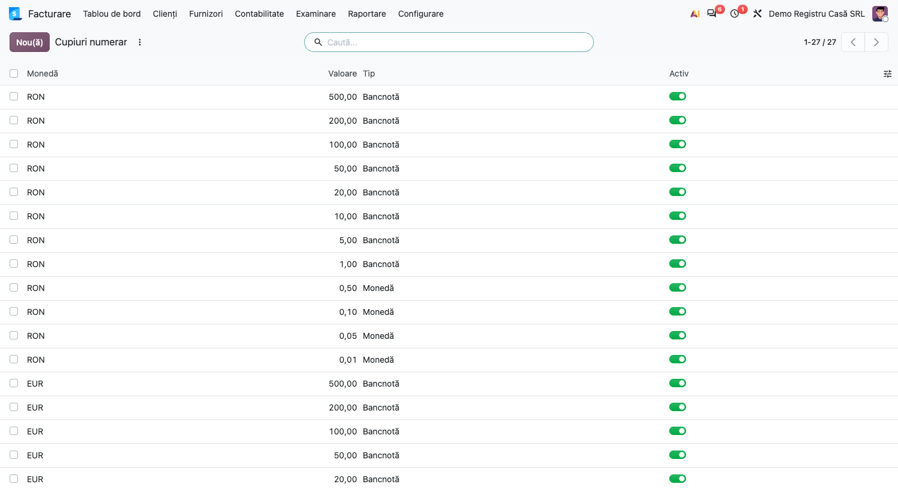
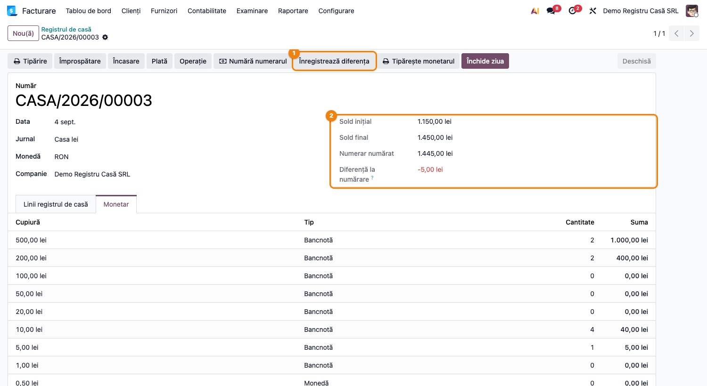
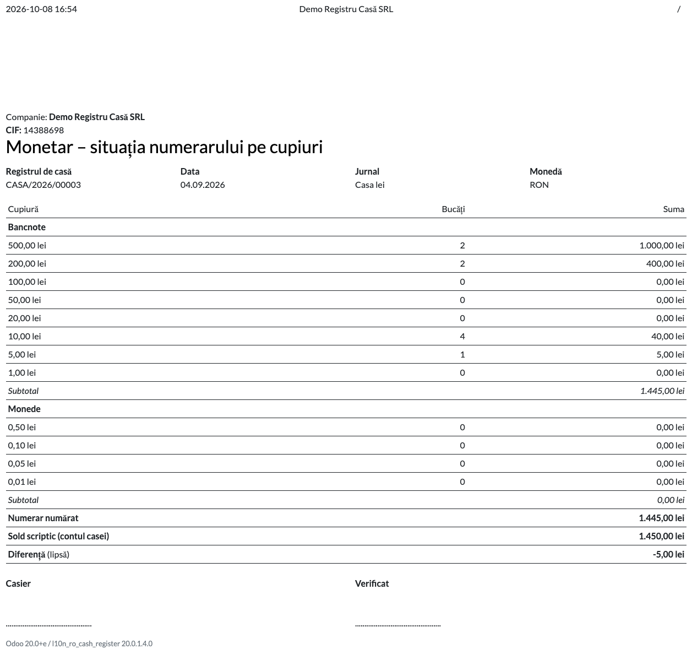
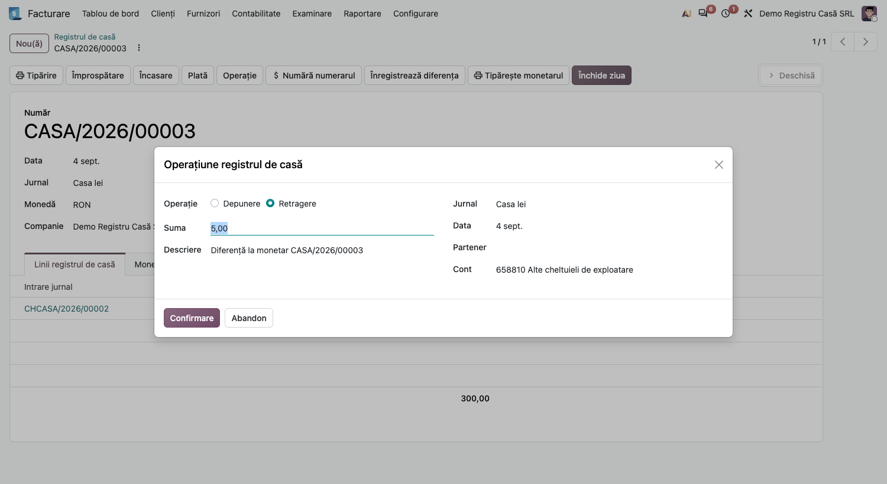
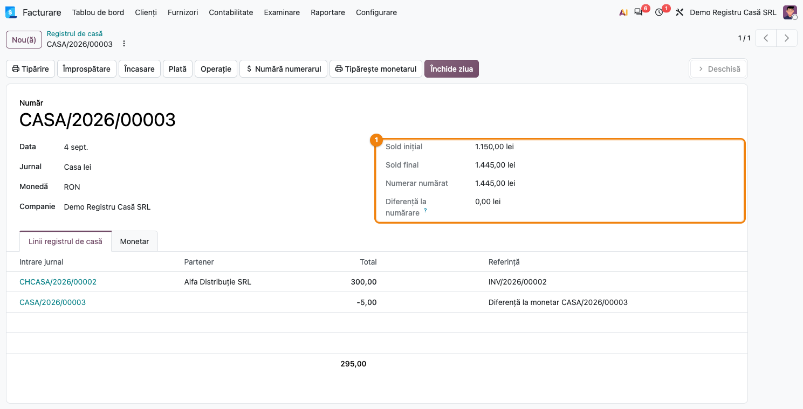

# Fișă Modul: Registrul de casă zilnic, cu închiderea zilei și monetarul (14-4-7A)

**Poziție plan:** C20  
**Modul:** `l10n_ro_cash_register`  
**Suită:** `l10n-romania`  
**FR:** FR-28  
**Capitol manual:** Cap 8.4  
**Utilizator principal:** Casier, contabil, contabil-șef (redeschiderea zilei)  
**Prioritate:** 🔴 Ridicată (orice firmă cu casierie trebuie să întocmească zilnic registrul de casă)

---

## 1. Scop business

Modulul transformă jurnalul de numerar într-un **registru de casă zilnic**: un document numerotat
pentru fiecare casierie și zi, cu sold reportat din ziua precedentă, mișcările zilei și soldul de la
sfârșitul zilei, tipărit în forma formularului **14-4-7A**. Din registru, casierul înregistrează
încasări, plăți și alte operațiuni de casă, iar la sfârșitul zilei **închide ziua**: soldul se
îngheață și nicio notă pe contul casei nu mai poate fi postată, trecută în ciornă sau ștearsă cu
o dată din ziua închisă sau dinaintea ei. Contabilul-șef poate **redeschide** ziua, cu urmă în
istoric.

Înainte de închidere, casierul poate face **monetarul**: numără numerarul din casă pe cupiuri
(bancnote și monede), vede pe registru diferența față de soldul contului casei (plus sau lipsă de
casă), tipărește situația numerarului pe cupiuri, semnată, și înregistrează diferența printr-o
operațiune de casă precompletată. Pe casieriile unde monetarul este obligatoriu, ziua nu se închide
nenumărată sau cu diferență neînregistrată.

Modulul nu acoperă importul extraselor bancare (MT940) și nici reconcilierea bancară; acestea sunt
module complementare.

## 2. Bază legală și context

- **Registrul de casă** — cod **14-4-7A**, poziția 27 în Nomenclatorul documentelor
  financiar-contabile (**OMFP 2634/2015, Anexa 2**, Grupa a IV-a „Mijloace bănești și decontări”).
  Norma specifică: se întocmește **zilnic**, de casier, pe baza documentelor justificative de
  încasare și plată; stabilește soldul de casă la sfârșitul fiecărei zile, care se reportează în
  ziua următoare. Conținutul minim (Anexa 1 pct. 2 și 10): contul casei, data, nr. act de casă,
  nr. anexe, explicații, încasări, plăți, sold reportat și sold final, semnături.
- **Anexa 1 pct. 58 lit. d) și h)** — programul informatic trebuie să asigure controlul datelor
  introduse și să împiedice modificarea datelor din perioadele închise. Închiderea zilei de casă
  aplică această regulă pe contul casei: după închidere, o mișcare datată în urmă ar schimba un
  sold deja reportat și tipărit.
- **Anexa 1 pct. 58 lit. k)** — orice listare poartă denumirea programului informatic și versiunea;
  raportul tipărit are această mențiune în subsol.
- **Anexa 1 pct. 12, 36 și 56** — listarea pe hârtie nu este obligatorie zilnic: obligatorie este
  **întocmirea** zilnică; documentele se pot păstra electronic, cu condiția să poată fi listate
  oricând.
- **Monetarul** este un document de **control intern** al casieriei: forma și periodicitatea
  numărării le stabilește conducerea entității prin procedurile proprii, inclusiv cele de
  inventariere (**OMFP 1802/2014, pct. 83 alin. (2)**). Elementele se reflectă în contabilitate la
  valoarea pusă de acord cu rezultatele inventarierii (pct. 82 alin. (2)); efect contabil are deci
  doar **diferența** constatată, nu numărarea în sine.
- **Imputarea lipsei** către casierul salariat se face pe baza unei note de constatare și evaluare a
  pagubei, prin acordul părților și în limita a 5 salarii minime brute (**Codul muncii, art. 254
  alin. (3)–(4)**), iar fără acord pe cale judecătorească. De aceea modulul **nu impută automat**.
- **Lipsa de numerar neimputabilă** este tratată de regulă ca cheltuială nedeductibilă, fiind
  efectuată în afara scopului activității economice (**Codul fiscal, art. 25 alin. (1)**);
  încadrarea finală rămâne la aprecierea consultantului fiscal.
- **Legea 70/2015** (plafoanele de încasări și plăți în numerar) — **nu** este verificată de modul;
  vezi secțiunea 11.

> **Surse:** [OMFP 2634/2015, Anexele 2 și 3 — MFinanțe (PDF)](https://mfinante.gov.ro/documents/35673/219198/anexe2_3ordin2634_2015.pdf)
> · [Anexa 2 — Portal Legislativ](https://legislatie.just.ro/Public/DetaliiDocument/173807)
> · [Anexa 1 — ANAF (PDF)](https://static.anaf.ro/static/10/Anaf/legislatie/OMFP_2634_2015.pdf)

## 3. Utilizatori și roluri

| Rol | Ce face în modul |
|---|---|
| **Casier** | înregistrează încasările, plățile și operațiunile de casă din registru; numără numerarul (monetarul) și semnează situația pe cupiuri; închide ziua |
| **Contabil** | verifică soldurile, tipărește registrul, corelează cu notele contabile; verifică monetarul și înregistrează diferența pe contul potrivit |
| **Contabil-șef** | redeschide o zi închisă, când o corecție nu se poate face printr-o notă datată azi |
| **Consultant implementare** | configurează jurnalul de numerar și explică regula închiderii |

Meniul și accesul la registru sunt rezervate grupului **Facturare / Contabilitate → Administrator**
(`account.group_account_manager`). **Modulul nu separă rolurile:** orice utilizator cu acces la
registru — inclusiv casierul care a închis ziua — poate și redeschide. Separarea „casierul închide,
contabilul-șef redeschide” se asigură prin procedură internă; programul garantează doar urma în
istoric (cine a închis, cine a redeschis, când și cu ce sold).

La testare, folosiți doi utilizatori din acest grup — unul în rol de casier, altul de
contabil-șef — ca să vedeți în registru cine a închis și cine a redeschis.

## 4. Conturi și date implicate

| Cont | Denumire | Rol în flux |
|---|---|---|
| **5311** | Casa în lei (analitic per casierie, ex. 531102 „Casa lei”) | contul implicit al jurnalului de numerar; din el se calculează soldurile |
| **581** | Viramente interne | alimentarea casei din bancă; contul corespondent propus implicit în wizardul de operațiune |
| **4111** | Clienți | încasări de la clienți |
| **401** | Furnizori | plăți către furnizori |
| **542** | Avansuri de trezorerie | avansuri în numerar date angajaților |
| **7588** / **6588** | Alte venituri / cheltuieli din exploatare (în planul Odoo RO: 758800 / 658810) | **Cont profit** / **Cont pierderi** pe jurnal, pentru plusurile și minusurile de casă constatate; contul propus la **Înregistrează diferența** |
| **65882** | Alte cheltuieli de exploatare nedeductibile (658820) | contul propus pentru lipsă când jurnalul nu are **Cont pierderi** sau a rămas pe contul generic 999xxx |
| **473** | Decontări din operațiuni în curs de clarificare | diferența de casă încă nelămurită (lipsă: 473 = 5311; plus: 5311 = 473), închisă ulterior pe 6588 / 4282 / 7588 |
| **4282** | Alte creanțe în legătură cu personalul | lipsa imputată casierului salariat (4282 = 5311), recuperată prin încasare (5311 = 4282) sau reținere din salariu (421 = 4282) |

Date minime pentru demo (sunt cele din capturi):

- casieria **Casa lei** (jurnal de tip numerar, cod `CASA`);
- parteneri: client **Alfa Distribuție SRL**, furnizor **Papetăria Centrală SRL**, angajat
  **Ionescu Andrei**;
- trei facturi: două facturi de vânzare către Alfa (413,22 + TVA 21% = 500,00 lei; 247,93 + TVA =
  300,00 lei) și factura de rechizite PC-2291 de la Papetăria (165,29 + TVA = 200,00 lei);
- trei zile consecutive de operațiuni (vezi „Note de monografie”): ziua 1 alimentare 1.000 lei,
  ziua 2 încasare 500 / plată 200 / avans 150, ziua 3 încasare 300;
- utilizatorii **Maria Popescu** (casier) și **Elena Dumitrescu** (contabil-șef);
- monetarul zilei 3: în casă se numără 1.445 lei (2 × 500, 2 × 200, 4 × 10, 1 × 5), față de soldul
  scriptic de 1.450 lei — **lipsă de 5 lei**.

## 5. Configurare inițială

1. Instalați `l10n_ro_account_sequence` și `l10n_ro_cash_register` pe o companie cu planul de
   conturi românesc.
2. **Facturare / Contabilitate → Configurare → Jurnale** → deschideți jurnalul de tip **Numerar**
   și verificați:
   - **Cont numerar** = analiticul de 5311 al casieriei; fiecare casierie are **propriul** analitic
     (două jurnale pe același cont își amestecă soldurile);
   - **Prefix secvență** (codul jurnalului) — dă și numărul registrului, ex. `CASA/2026/00002`;
   - **Cont profit** / **Cont pierderi** = 7588 / 6588 (plusuri / minusuri de casă). Planul Odoo RO
     propune la crearea jurnalului conturile generice **999001 / 999002**, care nu există în planul
     de conturi românesc și trebuie înlocuite. Dacă au rămas pe jurnal, monetarul nu le folosește:
     propune 7588 pentru plus și 65882 pentru lipsă. Minusul imputabil casierului se trece pe 4282,
     alegând contul în operațiunea de casă;
   - **Monetar obligatoriu la închiderea zilei** — bifați-l pe casieriile unde procedura internă cere
     numărarea zilnică: ziua nu se mai închide fără monetar sau cu diferență neînregistrată.

   

   - în filele **Plăți de primit** și **Plăți efectuate**, metodele de plată folosesc **contul
     casei** (531102), nu un cont de „plăți în curs”. La jurnalele create după instalarea
     `l10n_ro_account_sequence`, setarea se face automat. La un jurnal **existent**, rulați din
     lista jurnalelor acțiunea **Elimină conturile de plăți în curs** (meniul **Acțiuni**) —
     altfel încasările și plățile rămân pe contul în curs și **nu apar în registru**. Atenție:
     acțiunea **mută și liniile deja postate** de pe contul în curs pe contul casei; rulați-o doar
     cu acordul contabilului.
3. Pe companie, contul de **transfer intern** (581) este completat — wizardul de operațiune îl
   propune implicit ca și cont corespondent.
4. Pentru istoric existent: în lista jurnalelor, selectați casieria și rulați acțiunea **Generează
   registrele de casă lipsă** (meniul **Acțiuni**), care creează registrele pentru toate zilele cu
   mișcări pe contul casei, plus ziua curentă. Există și un cron cu aceeași acțiune, livrat
   **inactiv**.
5. Atribuiți utilizatorilor grupul **Administrator** pe Facturare / Contabilitate (vezi secțiunea 3).
6. **Facturare / Contabilitate → Configurare → Contabilitate → Cupiuri numerar** — verificați
   cupiurile active. Modulul livrează leul și euro; o cupiură scoasă din circulație se arhivează, o
   valută nouă se adaugă aici (pasul 9).

## 6. Flux de utilizare

### Pasul 1 — Lista registrelor de casă

**Facturare / Contabilitate → Contabilitate → Tranzacții → Registrul de casă**, sau un clic pe
cardul casieriei din tabloul de bord (pentru companiile din România, cardul de numerar deschide
registrul, nu lista generică de plăți).

Lista are **un rând pe casierie și zi**: număr, dată, jurnal, **Sold inițial**, **Sold final** și
**Stare** (*Deschisă* / *Închisă*).


**Găsiți pe ecran:** coloanele **Sold inițial** și **Sold final** pe fiecare zi și coloana
**Stare**. În captură: zilele 2, 3 și 4 septembrie, plus registrul zilei curente (creat de acțiunea
de generare, fără mișcări, deci cu sold inițial = sold final).
**Verificați:** soldul inițial al fiecărei zile este egal cu soldul final al zilei anterioare (în
captură: 0 → 1.000; 1.000 → 1.150; 1.150 → 1.450); zilele deja închise (aici, ziua 1) nu au între
ele o zi rămasă deschisă. Zilele 2 și 3 sunt încă deschise — închiderea lor urmează în pașii 5–6.

Modulul **nu impune ordinea** închiderii. Atenție: închiderea unei zile blochează și **toate
zilele dinaintea ei** (pasul 7), chiar dacă acestea apar încă *Deschisă*; închideți zilele în
ordine, una câte una.

Registrul unei zile se creează automat la postarea unei plăți pe casierie sau prin acțiunea de
generare a registrelor lipsă. Nu pot exista două registre pentru aceeași casierie și zi. Numărul
registrului urmează **ordinea creării**, nu ordinea zilelor: un registru creat târziu pentru o zi
din urmă primește următorul număr liber. Registrul are formatul `CASA/2026/NNNNN`, ca notele de
casă fără tip, dar **contor propriu**: registrul `CASA/2026/00002` și nota `CASA/2026/00002` sunt
documente diferite.

### Pasul 2 — Formularul registrului și operarea zilei

Deschideți registrul zilei. Bara de sus are butoanele **Tipărire**, **Împrospătare**, **Încasare**
①, **Plată** ②, **Operație** ③, **Numără numerarul** (monetarul, pașii 10–13) și **Închide ziua**;
în dreapta, starea (*Deschisă* / *Închisă*).


- ① **Încasare** — deschide o încasare (plată de primit) pe casierie, cu data registrului; primește
  număr de **chitanță** (ex. `CHCASA/2026/00001`) și se lettrează cu factura clientului;
- ② **Plată** — deschide o plată (plată efectuată) pe casierie, cu data registrului; primește număr
  de **dispoziție de plată** (ex. `PLCASA/2026/00001`) și se lettrează cu factura furnizorului;
- ③ **Operație** — deschide wizardul de operațiune de casă (pasul 3), pentru operațiunile fără
  factură.

Încasările și plățile **pe factură** se fac cu **Încasare / Plată** — sau direct din factură, cu
butonul de înregistrare a plății, alegând jurnalul casei — nu din wizard: doar așa au act de casă numerotat și
închid factura.

Fila **Linii registrul de casă** listează notele postate pe contul casei în ziua respectivă, în
ordinea înregistrării: numărul actului de casă, partener, sumă (plus = încasare, minus = plată) și
referință (factura achitată sau explicația).
**Sold final** = **Sold inițial** + totalul liniilor (în captură: 1.000 + 150 = 1.150 lei).

Soldurile se recalculează automat la postarea, trecerea în ciornă sau ștergerea oricărei note pe
contul casei — pentru ziua respectivă și pentru toate zilele următoare. **Împrospătare** rămâne
doar pentru recalcul manual.

### Pasul 3 — Operațiune de casă (wizard)

Butonul **Operație** deschide fereastra **Operațiune registrul de casă**, pentru operațiunile
**fără factură**: alimentarea casei din bancă sau depunerea numerarului la bancă (581), avansuri de
trezorerie (542), restituiri de avans, plusuri de casă etc.:


- **Operație**: *Depunere* (intrare în casă) sau *Retragere* (ieșire din casă);
- **Suma**, **Descriere** (apare ca explicație în registru), **Partener**;
- **Cont** — contul corespondent; implicit 581, se schimbă după natura operațiunii (542, 7588
  etc.);
- **Jurnal** și **Data** vin din registru.

**Confirmare** creează și postează imediat nota contabilă: *Depunere* = debit casă / credit cont
ales; *Retragere* = debit cont ales / credit casă. Actul de casă primește numărul notei
(`CASA/2026/NNNNN`), fără serie de chitanță sau dispoziție, și nu se lettrează cu nicio factură.

### Pasul 4 — Tipărirea registrului

**Tipărire** (din formular sau, pentru mai multe zile, din listă, după selectarea rândurilor)
produce registrul în forma formularului **14-4-7A**:


**Găsiți pe ecran:** antetul cu compania, CIF și NRC; rândul **Sold reportat din ziua
precedentă**; liniile zilei (NrCrt, nr. act de casă, nr. anexe, explicații, partener, încasări,
plăți, sold cumulat); rândurile **Total încasări**, **Total plăți**, **Sold la sfârșitul zilei**;
rubricile de semnătură; în subsol, programul și versiunea.
**Verificați:** soldul reportat = soldul final al zilei anterioare (1.000,00); soldul reportat +
total încasări − total plăți = sold la sfârșitul zilei (1.000 + 500 − 350 = 1.150,00); soldul
cumulat de pe ultima linie este egal cu soldul de la sfârșitul zilei.
Coloana **Nr. anexe** numără atașamentele notei contabile (documentele justificative scanate).

### Pasul 5 — Închiderea zilei

După ce ultima operațiune a zilei este înregistrată și registrul verificat, casierul apasă
**Închide ziua**. Apare confirmarea:


Mesajul spune exact efectul: după închidere, **nicio înregistrare pe contul casei nu mai poate fi
datată în această zi sau înaintea ei** până la redeschidere. **Ok** închide ziua.

Închiderea este refuzată dacă:

- ziua este **în viitor**;
- soldul final este **negativ** — casieria nu poate plăti mai mult decât are; corectați întâi
  înregistrările.

### Pasul 6 — Registrul închis


- ① starea devine **Închisă**;
- ② apar **Sold la închidere** (soldul înghețat), **Închisă de** și **Închisă la**.

**Verificați:** *Sold la închidere* = *Sold final* (1.150,00 lei); *Închisă de* este casierul
care a apăsat butonul.

Pe un registru închis: butoanele **Încasare**, **Plată**, **Operație** și **Închide ziua** dispar,
locul lor îl ia **Redeschide**; data, casieria și numărul nu se mai pot modifica; registrul nu se
poate șterge.

### Pasul 7 — O postare în ziua închisă este refuzată

Exemplu: după închiderea zilei 2, contabilul descoperă o plată de 80 lei către furnizor, făcută
în ziua 2 dar neînregistrată, și încearcă să posteze nota cu data zilei 2 (din jurnalul de casă,
**Postează**). Odoo refuză:


Mesajul numește registrul închis, casieria și ziua. Aceeași regulă se aplică la **trecerea în
ciornă** și la **ștergerea** unei note postate pe contul casei, datate în ziua închisă **sau
înaintea ei** (o mișcare mai veche ar schimba soldul reportat în ziua închisă). Notele datate
**după** ultima zi închisă și notele pe alte casierii nu sunt afectate.

Corecția se face, de regulă, **fără redeschidere**. Documentul justificativ (dispoziția de plată,
chitanța furnizorului) își păstrează **data reală** (ziua 2); doar înregistrarea în registru se face
azi. Plafoanele de numerar (Legea 70/2015) se judecă tot pe ziua reală a plății.

- **stornare** sau **notă de corecție datată în ziua curentă** — zilele închise rămân neschimbate,
  iar diferența apare în registrul zilei de azi, cu explicația ei;
- **redeschiderea** (pasul 8) doar când corecția trebuie să apară chiar în ziua greșită, cu acordul
  contabilului-șef.

### Pasul 8 — Redeschiderea zilei

Pe registrul închis, contabilul-șef apasă **Redeschide** (programul nu restricționează butonul pe
rol — vezi secțiunea 3). Confirmarea avertizează că se redeschid
și **zilele închise de după aceasta din aceeași casierie** (soldul se reportează din zi în zi,
deci o corecție în ziua redeschisă le schimbă și lor soldurile):


După **Ok**, registrul revine la starea **Deschisă**, butoanele de operare reapar, iar istoricul
fiecărui registru redeschis păstrează urma: cine a închis, cine a redeschis și soldul de la
închidere.


**Verificați în istoric:** schimbarea *Deschisă → Închisă* cu numele casierului; mesajul
„Registru de casă redeschis de … (soldul la închidere era …)” și schimbarea *Închisă → Deschisă*
cu numele contabilului-șef. După corecție, **închideți din nou** ziua și toate zilele redeschise,
în ordine.

### Pasul 9 — Cupiurile de numerar

**Facturare / Contabilitate → Configurare → Contabilitate → Cupiuri numerar** listează bancnotele și
monedele numărate la monetar, pe monedă: **Monedă**, **Valoare**, **Tip** (*Bancnotă* / *Monedă*),
**Activ**.



**Găsiți pe ecran:** cupiurile leului (500 lei → 1 ban) și ale euro (500 € → 1 cent).
**Verificați:** fiecare cupiură în circulație din moneda casieriei este activă; o cupiură apare o
singură dată pe monedă. Lista se editează direct în tabel.

### Pasul 10 — Numărarea numerarului (monetarul)

La sfârșitul zilei, înainte de închidere, casierul deschide registrul zilei și apasă **Numără
numerarul**. Apare fila **Monetar**, cu câte un rând pentru fiecare cupiură activă a monedei
casieriei; casierul completează **Cantitatea** (bucățile numărate), iar **Suma** se calculează pe
rând.



**Găsiți pe ecran:** ② în dreapta, sub soldurile zilei, **Numerar numărat** și **Diferență la
numărare**; în fila **Monetar**, bucățile pe fiecare cupiură.
**Verificați:** *Numerar numărat* = totalul coloanei *Suma*; *Diferență la numărare* = *Numerar
numărat* − *Sold final* (în captură: 1.445 − 1.450 = **−5,00 lei**, lipsă de casă, în roșu; un plus
apare în verde). Butonul ① **Înregistrează diferența** apare doar cât diferența nu este zero.

Apăsat din nou, **Numără numerarul** adaugă doar cupiurile lipsă (de exemplu una activată ulterior),
fără să dubleze rândurile. La o casierie în valută (5314) se numără cupiurile valutei, iar diferența
se calculează față de soldul **în valută** al contului casei.

### Pasul 11 — Tipărirea monetarului

**Tipărește monetarul** produce situația numerarului pe cupiuri, care se semnează de casier și de
cel care verifică și se păstrează lângă registrul zilei:



**Găsiți pe ecran:** antetul cu compania și CIF; registrul, data, casieria și moneda; cupiurile
grupate pe **Bancnote** și **Monede**, fiecare grup cu subtotal; rândurile **Numerar numărat**,
**Sold scriptic (contul casei)** și **Diferență** (cu mențiunea *lipsă* / *plus*); semnăturile; în
subsol, programul și versiunea.
**Verificați:** subtotal bancnote + subtotal monede = numerar numărat (1.445,00); numerar numărat −
sold scriptic = diferență (−5,00); soldul scriptic este soldul final din registru.

Tipărită **înainte** de înregistrarea diferenței, situația este documentul de constatare al lipsei
sau plusului.

### Pasul 12 — Înregistrarea diferenței

**Înregistrează diferența** deschide operațiunea de casă (pasul 3) precompletată:



- **Operație**: *Retragere* pentru lipsă, *Depunere* pentru plus;
- **Suma**: valoarea absolută a diferenței (5,00);
- **Descriere**: „Diferență la monetar” urmat de numărul registrului;
- **Cont**: **Cont pierderi** al jurnalului pentru lipsă (658810), **Cont profit** pentru plus
  (758800). Dacă jurnalul nu le are sau a rămas pe conturile generice 999xxx, se propun 65882,
  respectiv 7588.

**Verificați contul înainte de Confirmare** și schimbați-l după constatare: **473** cât diferența
este în curs de clarificare, **4282** pentru lipsa imputată casierului cu acordul acestuia. Modulul
nu alege singur între ele.

La o casierie în valută butonul refuză: diferența se înregistrează printr-o notă contabilă cu suma
în valută, fiindcă operațiunea de casă lucrează în lei.

### Pasul 13 — Monetarul după înregistrare și închiderea zilei

După **Confirmare**, nota contabilă apare în **Linii registrul de casă**, iar soldul final se
recalculează:



**Verificați:** linia nouă (−5,00, „Diferență la monetar …”); *Sold final* = *Numerar numărat*
(1.445,00); *Diferență la numărare* = 0,00, iar butonul **Înregistrează diferența** a dispărut.
Ziua se poate închide acum (pasul 5).

Pe o casierie cu **Monetar obligatoriu la închiderea zilei**, **Închide ziua** refuză ziua fără
monetar sau cu diferență nenulă (secțiunea 9). După închidere, cantitățile din monetar nu se mai pot
modifica până la redeschiderea zilei.

### Note de monografie și raportare

Notele din capturi (casieria **Casa lei**, cont 5311, analitic 531102):

```
Ziua 1  Alimentare casă din bancă (CEC 0045)   Dr 5311   1.000  =  Cr 581    1.000
        (partea de bancă, din extras:            Dr 581    1.000  =  Cr 5121   1.000)
Ziua 2  Chitanța CHCASA/2026/00001 — Alfa       Dr 5311     500  =  Cr 4111     500   (factura INV/2026/00001)
        Dispoziția PLCASA/2026/00001 — Papetăria Dr 401      200  =  Cr 5311     200   (factura PC-2291)
        Avans deplasare Cluj — Ionescu Andrei   Dr 542      150  =  Cr 5311     150   (wizard)
Ziua 3  Chitanța următoare — Alfa               Dr 5311     300  =  Cr 4111     300   (a doua factură)
Ziua 3  Lipsă la monetar (pasul 12)              Dr 6588       5  =  Cr 5311       5   (wizard, cont pierderi al jurnalului)
```

Solduri: ziua 1: 0 → 1.000; ziua 2: 1.000 → 1.150; ziua 3: 1.150 → 1.450 înainte de monetar, 1.445
după înregistrarea lipsei.

Diferențele la monetar, după constatare:

```
Plus de casă                                   Dr 5311 = Cr 7588
Sumă încasată necuvenită (ex. rest nedat)      Dr 5311 = Cr 473
Lipsă neimputabilă                             Dr 6588 (65882, nedeductibilă) = Cr 5311
Lipsă imputată casierului, cu acord            Dr 4282 = Cr 5311
Lipsă constatată acum, imputată ulterior       Dr 6588 = Cr 5311, apoi Dr 4282 = Cr 7581 / 7588
Diferență în curs de clarificare               Dr 473 = Cr 5311 (lipsă) / Dr 5311 = Cr 473 (plus)
  — închidere ulterioară                       Dr 6588 / Dr 4282 = Cr 473; Dr 473 = Cr 7588
Recuperarea lipsei de la casier                Dr 5311 = Cr 4282 sau Dr 421 = Cr 4282
```

Contul 473 trebuie să ajungă la sold zero până la bilanț.

- Avansul de trezorerie se justifică ulterior prin decont (Dr 6xx / Dr 4426 = Cr 542), iar restul
  nefolosit se restituie în casă (Dr 5311 = Cr 542) — notele de decont nu sunt generate de modul.
- Plata uitată de 80 lei din pasul 7, înregistrată ca notă de corecție **datată azi**:
  `Dr 401  80 = Cr 5311  80`, cu explicația „Plată factura PC-2297 din ziua 2, înregistrată
  ulterior”.
- **Ce citește registrul:** doar notele **postate** pe contul implicit al jurnalului (5311 analitic).
  Mișcările pe 542 sau pe alte conturi de trezorerie nu intră în registrul de casă.
- **Raportare:** registrul tipărit (14-4-7A) se arhivează zilnic (electronic sau pe hârtie). La
  sfârșitul lunii, soldul **analiticului** 5311xx al casieriei din balanța analitică este egal cu
  soldul ultimei zile din registrul acelei casierii; sinteticul 5311 este suma soldurilor tuturor
  casieriilor în lei.

## 7. Legături cu alte module / declarații

| Modul | Rol |
|---|---|
| `account` | jurnale, plăți, note contabile |
| `l10n_ro_account_sequence` | numerotarea actelor de casă (dispoziții, chitanțe) și a registrului |
| `l10n_ro_cash_register_report` (suita `l10n_ro_ent`) | raport pe interval de zile, cu drill-down și export PDF/XLSX; aceleași cifre, fără numerotare (Enterprise) |
| `l10n_ro_account_bank_statement_import_mt940_*` | importul extraselor bancare — complementar, în afara acestui modul |

**Ce e automat:** crearea registrului zilei la postarea unei plăți pe casierie; calculul și
recalcularea soldurilor în lanț; nota contabilă din wizardul de operațiune; blocarea postării,
trecerii în ciornă și ștergerii notelor pe casă datate într-o zi închisă sau înaintea ei;
redeschiderea în cascadă a zilelor închise ulterioare; urma în istoric; rândurile monetarului pe
cupiurile monedei casieriei, totalul numărat și diferența față de soldul scriptic; precompletarea
operațiunii de casă cu diferența; blocarea închiderii fără monetar, pe casieriile unde e obligatoriu.

**Ce rămâne manual:** apăsarea **Închide ziua** în fiecare zi (nu există închidere automată);
tipărirea și semnarea registrului; activarea cronului de generare a registrelor lipsă, dacă se
dorește; corecțiile (stornare / notă datată azi / redeschidere aprobată); respectarea plafoanelor
de numerar; numărarea fizică și completarea bucăților; alegerea contului diferenței (473 / 4282 /
6588 / 7588) și imputarea către casier; semnarea monetarului tipărit; diferența unei casierii în
valută (notă contabilă manuală, cu suma în valută).

## 8. Verificări pentru consultant

- [ ] Registrul unei zile are număr cu prefixul codului jurnalului (ex. `CASA/2026/…`), cu contor
      propriu, independent de notele de casă.
- [ ] Metodele de plată ale casieriei folosesc contul casei (nu un cont de plăți în curs).
- [ ] O încasare din butonul **Încasare** primește număr de chitanță și închide factura clientului.
- [ ] O plată postată pe casierie într-o zi fără registru creează registrul zilei.
- [ ] **Generează registrele de casă lipsă** creează registre pentru toate zilele cu mișcări, plus azi.
- [ ] *Depunere* din wizard: notă postată cu debit 5311; *Retragere*: notă cu credit 5311.
- [ ] Soldul inițial al fiecărei zile = soldul final al zilei anterioare (lista din pasul 1).
- [ ] O notă postată într-o zi anterioară actualizează singură soldurile zilei și ale zilelor
      următoare, fără **Împrospătare**.
- [ ] Raportul tipărit: sold reportat + total încasări − total plăți = sold la sfârșitul zilei;
      subsolul are programul și versiunea.
- [ ] **Închide ziua** pe o zi trecută cu sold pozitiv: starea *Închisă*, *Sold la închidere* =
      *Sold final*, *Închisă de* = utilizatorul curent.
- [ ] Postarea unei note pe casă datate în ziua închisă **sau înaintea ei** este refuzată cu
      mesajul din pasul 7; la fel trecerea în ciornă și ștergerea unei note postate din acea zi.
- [ ] O notă pe casă datată **după** ziua închisă, sau pe altă casierie, se postează normal.
- [ ] Pe registrul închis nu se pot modifica data, jurnalul, numărul și nu se poate șterge.
- [ ] **Închide ziua** pe o zi din viitor sau cu sold negativ este refuzată.
- [ ] Un utilizator fără acces de Administrator contabilitate nu vede meniul registrului.
- [ ] **Redeschide** pe ziua 2, cu ziua 3 tot închisă: ambele devin *Deschisă*, fiecare cu mesajul
      de redeschidere în istoric.
- [ ] **Numără numerarul** pe un registru în lei adaugă câte un rând pe fiecare cupiură activă a
      leului; apăsat a doua oară nu dublează rândurile.
- [ ] *Diferență la numărare* = *Numerar numărat* − *Sold final*; negativă (lipsă) în roșu, pozitivă
      (plus) în verde.
- [ ] **Tipărește monetarul**: subtotalurile pe bancnote și monede dau numerarul numărat; numerar
      numărat − sold scriptic = diferența; subsolul are programul și versiunea.
- [ ] **Înregistrează diferența** la o lipsă propune *Retragere*, suma diferenței și **Cont
      pierderi** al jurnalului; la un plus, *Depunere* și **Cont profit**.
- [ ] Cu jurnalul fără conturi de profit / pierderi sau rămas pe 999xxx, contul propus este 7588
      (plus), respectiv 65882 (lipsă).
- [ ] După **Confirmare**, diferența devine 0 și butonul **Înregistrează diferența** dispare.
- [ ] Cu **Monetar obligatoriu la închiderea zilei** bifat: **Închide ziua** este refuzată fără
      monetar și cu diferență nenulă; după înregistrarea diferenței, ziua se închide.
- [ ] Pe un registru închis, cantitățile din monetar nu se pot modifica, iar **Numără numerarul** nu
      mai apare.
- [ ] La o casierie în euro, monetarul numără cupiurile euro și compară cu soldul în euro al
      contului casei; **Înregistrează diferența** refuză.

## 9. Mesaje de eroare frecvente

| Mesaj | Cauză | Remediere |
|---|---|---|
| Registrul de casă … al casieriei … din … este închis. O înregistrare pe contul casei datată … i-ar schimba soldul: redeschideți întâi registrul. | postare, trecere în ciornă sau ștergere a unei note pe casă datate într-o zi închisă sau înaintea ei | notă de corecție / stornare datată azi; doar la nevoie, redeschiderea zilei de către contabilul-șef |
| Nu se poate închide o zi din viitor (…). | **Închide ziua** pe un registru cu dată ulterioară zilei curente | închideți ziua după ce s-a încheiat |
| Soldul registrului de casă … este negativ (…): casieria nu poate plăti mai mult decât are. Corectați înregistrările înainte de a închide ziua. | plățile zilei depășesc soldul disponibil (de obicei o încasare neînregistrată sau o dată greșită) | înregistrați încasarea lipsă sau corectați data notei, apoi închideți |
| Un registru de casă închis nu se poate modifica; redeschideți-l întâi. | schimbarea datei, casieriei sau numărului pe un registru închis | **Redeschide**, modificați, închideți din nou |
| Un registru de casă închis nu se poate șterge; redeschideți-l întâi. | ștergerea unui registru închis | **Redeschide** înainte de ștergere |
| Există deja un registru de casă pentru această casierie și zi. | al doilea registru pentru aceeași casierie și zi | folosiți registrul existent al zilei |
| Numărați numerarul pe cupiuri înainte de închiderea registrului de casă …. | **Închide ziua** pe o casierie cu monetar obligatoriu, fără monetar | **Numără numerarul**, completați bucățile, apoi închideți |
| Numerarul numărat în registrul de casă … diferă de soldul contului casei cu …. Înregistrați diferența înainte de închiderea zilei. | monetar obligatoriu și diferență nenulă | verificați numărarea; dacă diferența se confirmă, **Înregistrează diferența**, apoi închideți |
| Monetarul unei zile închise nu se poate modifica; redeschideți mai întâi ziua. | modificarea bucăților sau **Numără numerarul** pe o zi închisă | **Redeschide**, corectați, închideți din nou |
| Nu sunt definite cupiuri pentru …. Adăugați-le din Contabilitate > Configurare > Cupiuri numerar. | casieria are o monedă fără cupiuri (alta decât leu sau euro) | adăugați cupiurile valutei (pasul 9) |
| Diferența unei casierii în valută se înregistrează printr-o notă contabilă în …, cu suma în valută. | **Înregistrează diferența** pe o casierie în valută | notă contabilă pe 5314 cu suma în valută și contul diferenței |
| Încasarea / plata nu apare în registru | metoda de plată a jurnalului folosește un cont de plăți în curs, nu contul casei | **Elimină conturile de plăți în curs** pe jurnal (secțiunea 5), apoi verificați registrul |

## 10. Capturi de ecran

Capturile din `readme/screenshots/` sunt **generate automat** de `tests/test_screenshots.py`
(mixinul `ScreenshotCase` din `l10n_ro_doc_screenshots`, import defensiv), cu interfața în
**română**, pe planul de conturi RO și în RON, pe datele demo din secțiunea 4:

1. `01_jurnal_cash.png` — jurnalul de numerar „Casa lei” (cont 531102, prefix `CASA`, conturi de
   profit / pierderi 758800 / 658810).
2. `02_lista_registre.png` — lista registrelor: ziua 1 închisă, celelalte deschise, solduri în lanț.
3. `03_formular_registru.png` — registrul zilei 2, cu butoanele Încasare / Plată / Operație și
   liniile zilei (chitanță, dispoziție de plată, avans).
4. `04_wizard_operatiune.png` — wizardul de operațiune de casă (Depunere / Retragere).
5. `05_raport_pdf.png` — registrul tipărit, formular 14-4-7A.
6. `06_confirmare_inchidere.png` — confirmarea de la **Închide ziua**.
7. `07_registru_inchis.png` — registrul închis: Sold la închidere, Închisă de, Închisă la.
8. `08_blocare_postare.png` — mesajul de blocare la postarea unei note pe casă în ziua închisă.
9. `09_confirmare_redeschidere.png` — confirmarea de la **Redeschide**.
10. `10_registru_redeschis.png` — registrul redeschis, cu urma închiderii și redeschiderii în istoric.
11. `11_cupiuri.png` — cupiurile de numerar ale leului și euro (Configurare).
12. `12_monetar_numarare.png` — monetarul zilei 3: bucățile pe cupiuri, numerar numărat 1.445 lei,
    diferență −5,00 lei.
13. `13_monetar_pdf.png` — monetarul tipărit: situația numerarului pe cupiuri, cu semnături.
14. `14_inregistrare_diferenta.png` — operațiunea de casă precompletată cu lipsa (Retragere, 5,00,
    cont 658810).
15. `15_monetar_inregistrat.png` — registrul după înregistrarea lipsei: linia de −5,00, diferență zero.

Regenerare (testele modulului rulează pe o bază cu date demo):

```bash
./odoo/odoo-bin -c odoo.conf -d <db> -i l10n_ro,l10n_ro_cash_register,l10n_ro_doc_screenshots \
    --test-tags=fise_screenshots --stop-after-init
```

> Capturile cer modulul de tooling `l10n_ro_doc_screenshots` (suita `l10n_ro_ent`) și Playwright;
> dacă lipsesc, testul se sare.

## 11. Observații pentru manual

- Prezentați registrul ca **document zilnic numerotat** (14-4-7A), iar închiderea zilei ca
  **semnătura electronică a casierului** pe soldul zilei: după ea, ziua nu se mai schimbă fără
  urmă.
- Insistați pe regula de corecție: **după închidere, corecția se face azi** (stornare / notă de
  corecție); redeschiderea e excepția, aprobată de contabilul-șef, și redeschide în cascadă toate
  zilele închise de după ea, care trebuie apoi închise din nou.
- Blocarea privește doar **contul implicit al casieriei**; o casierie cu cont 5311 comun cu alta
  amestecă soldurile — un analitic de 5311 per casierie este obligatoriu.
- Limitări de spus clientului: plafoanele de numerar din Legea 70/2015 nu sunt verificate; nu
  există tipărire individuală a unui act de casă din linia registrului; cronul de generare a
  registrelor lipsă este livrat inactiv; închiderea zilei nu este automată și nu se impune ordinea
  zilelor; redeschiderea nu este restricționată pe rol; registrul este corect **doar pentru
  casieriile în moneda companiei (lei)** — soldurile se calculează în lei, deci o casierie în
  valută (5314, formularul 14-4-7/aA) nu este suportată. Excepție: **monetarul** unei casierii în
  valută numără cupiurile valutei și compară cu soldul în valută; diferența se înregistrează manual.
- Prezentați **monetarul** ca procedură de control intern: numărarea și semnarea situației pe cupiuri
  la sfârșitul zilei, apoi înregistrarea diferenței constatate. Insistați că alegerea contului
  (473 / 4282 / 6588 / 7588) e o decizie a contabilului, nu a casierului, și că imputarea către
  casier cere nota de constatare și acordul lui.
- Pentru analiză pe perioade (mai multe zile, export XLSX), recomandați în paralel raportul
  `l10n_ro_cash_register_report` (Enterprise); cifrele sunt aceleași.
