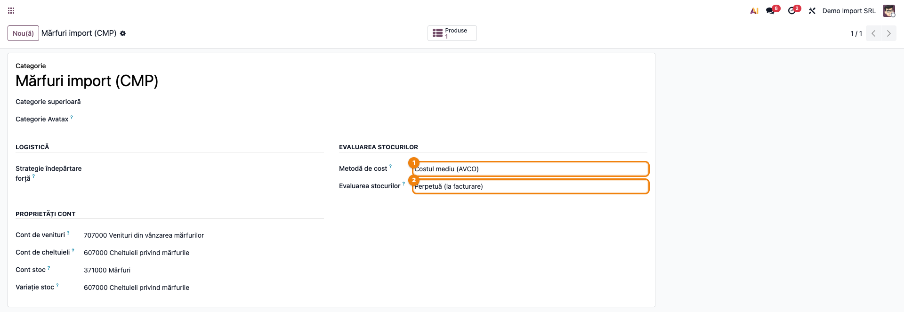
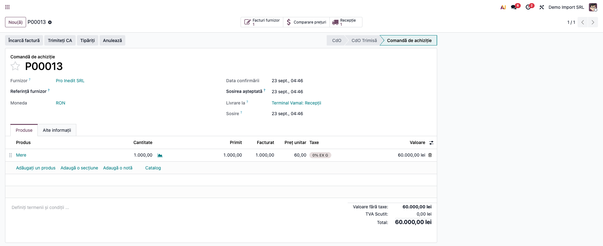
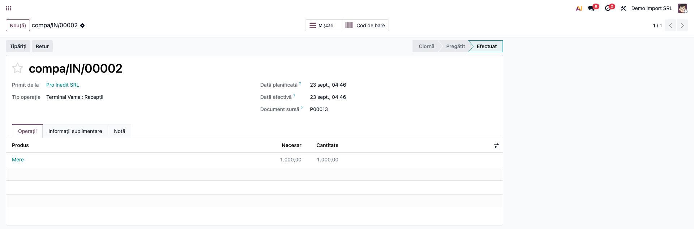
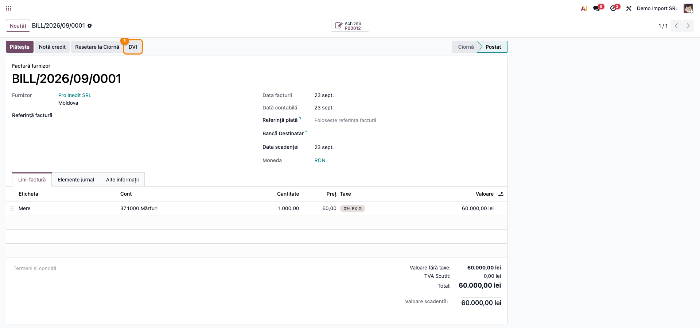
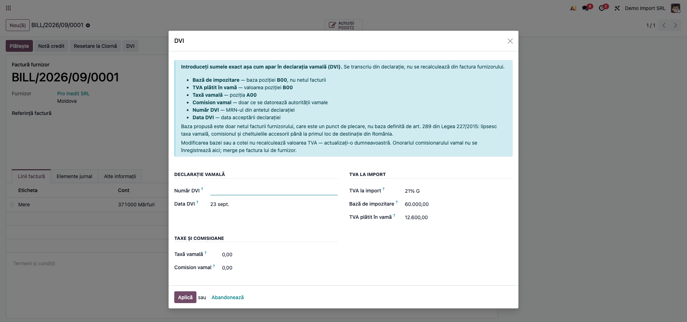
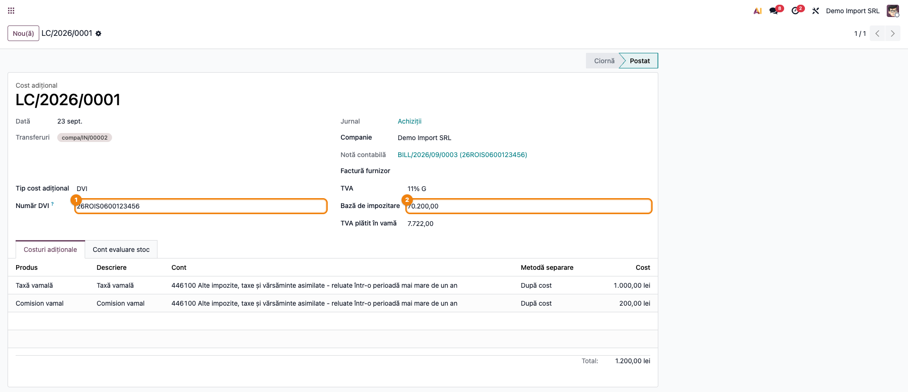
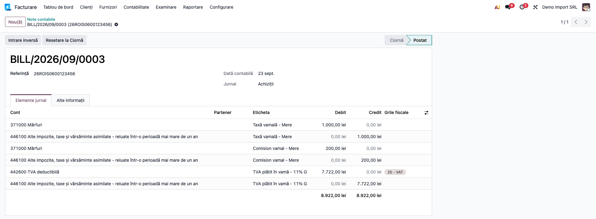
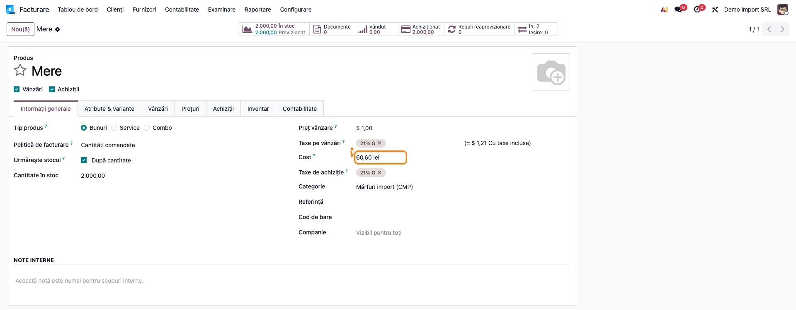
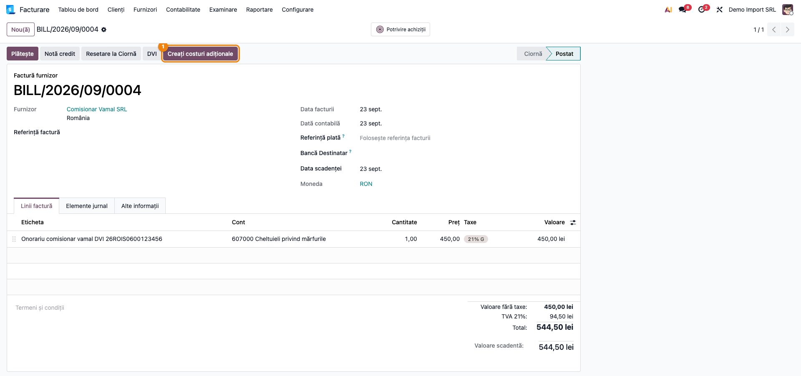
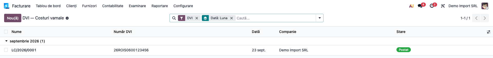

# Fișă Modul: Declarația Vamală de Import (DVI) ca cost de aterizare

**Modul:** `l10n_ro_customs_dvi`
**FR:** FR-15
**Capitol manual:** Cap 12.9
**Utilizator principal:** Contabil importuri, Operator achiziții
**Prioritate:** 🔴 Ridicată (afectează baza TVA deductibilă și costul stocului)

> Modulul se numea `terrabit_dvi` până la 23.09.2026. Vechiul nume rămâne ca modul tranzitoriu, fără
> conținut, doar ca dependențele existente să continue să se încarce.

---

## 1. Scop business

La importul de mărfuri din afara Uniunii Europene, autoritatea vamală emite o **Declarație Vamală de
Import (DVI)** care stabilește taxa vamală datorată și TVA-ul de plătit în vamă. Aceste sume nu se
regăsesc pe factura furnizorului extern și trebuie înregistrate separat, cu două efecte diferite:
taxele vamale **măresc costul mărfii**, iar TVA-ul la import este **deductibil** și nu atinge costul.

Modulul leagă declarația vamală de factura furnizorului printr-un **cost de aterizare** (landed cost)
atașat recepției. Rezultatul: costul unitar al produsului reflectă costul real de import, iar marja de
pe vânzare nu mai este supraevaluată.

Fără acest flux, taxele vamale ar rămâne cheltuială a perioadei, iar produsul ar ieși din gestiune la
un cost mai mic decât cel real.

## 2. Bază legală și context

Această secțiune este partea pe care consultantul o folosește când contabilul întreabă **ce cifră se
pune unde**. Nu e teorie: majoritatea erorilor de operare vin din confundarea a trei mărimi diferite —
valoarea facturii, valoarea statistică din declarație și baza de impozitare.

### 2.1 Baza de impozitare la import — art. 289 din Legea 227/2015

**Alin. (1):** baza este **valoarea în vamă a bunurilor, stabilită conform legislației vamale**, la
care se adaugă **orice taxe, impozite, comisioane și alte taxe datorate în afara României, precum și
cele datorate ca urmare a importului**, cu excepția TVA-ului care urmează a fi perceput.

**Alin. (2):** baza cuprinde și **cheltuielile accesorii — comisioane, ambalare, transport, asigurare
— care intervin până la primul loc de destinație a bunurilor în România**, *în măsura în care nu au
fost deja cuprinse în baza stabilită conform alin. (1)*. Sintagma subliniată este clauza
anti-dublă-numărare: transportul deja inclus în valoarea în vamă **nu se adaugă a doua oară**.
**Primul loc de destinație nu este frontiera**, ci destinația din documentul de transport (CMR) — în
practică depozitul importatorului — iar în lipsa mențiunii, primul loc de descărcare în România.

**Alin. (3):** baza nu cuprinde rabaturile, remizele, risturnele și sconturile acordate la data
exigibilității, daunele-interese, penalitățile, dobânzile de întârziere și ambalajele care circulă
prin schimb fără facturare (art. 286 alin. (4) lit. a)–d)).

Formula practică:

```
Bază TVA import = valoare în vamă
                + taxa vamală (A00) + accize + alte drepturi de import
                + cheltuieli accesorii până la primul loc de destinație în RO,
                  DOAR dacă nu sunt deja în valoarea în vamă
                − TVA însăși
```

### 2.2 Valoarea statistică din DVI **nu** este baza de impozitare

Sunt două mărimi cu scopuri diferite. Valoarea statistică servește statisticii de comerț exterior
(Reg. de punere în aplicare (UE) 2020/1197, Anexa V, Secțiunea 10) și reprezintă valoarea mărfurilor
**la frontiera statului membru de import**; pentru mărfuri puse în liberă circulație se folosește chiar
valoarea în vamă. Baza de impozitare servește calculului TVA și este definită de art. 289.

Ele **coincid numeric** în cazul simplu — marfă adusă direct peste frontiera română, fără taxă vamală
și fără cheltuieli accesorii ulterioare frontierei. **Diferă** când: există taxă vamală sau accize
(intră în baza TVA, nu în valoarea statistică); există transport intern de la frontieră până la primul
loc de destinație, nedeclarat în vamă (intră în baza TVA prin alin. (2)); marfa intră în UE prin alt
stat membru și se vămuiește în România; există reduceri cunoscute la data exigibilității.

> **Regula de operare:** se transcrie **baza poziției B00 din declarație**, nu valoarea statistică și
> nu netul facturii externe. Nu se recalculează — se copiază.

### 2.3 Unde intră transportul

Regulamentul (UE) 952/2013 (Codul Vamal al Uniunii) pornește de la valoarea de tranzacție (art. 70), la
care art. 71 alin. (1) lit. (e) **adaugă** transportul, asigurarea, încărcarea și manipularea **până la
locul de introducere pe teritoriul vamal al Uniunii**; art. 72 lit. (a) **exclude** transportul de după
intrarea pe teritoriul vamal.

| Segment de transport | Valoare în vamă (bază taxă vamală) | Bază TVA import |
|---|---|---|
| Din țara terță până la frontiera UE | **DA** — CVU art. 71 alin. (1) lit. (e) | DA, indirect, prin valoarea în vamă |
| De la frontiera UE la primul loc de destinație din RO | **NU** — CVU art. 72 lit. (a) | **DA** — art. 289 alin. (2) |
| După primul loc de destinație din RO | NU | NU |

Pentru un import din Republica Moldova vămuit în România, frontiera UE **este** frontiera română —
întregul transport extern se regăsește deja în valoarea în vamă.

Pe latura contabilă, transportul intră în **costul de achiziție** al mărfii: OMFP 1802/2014 pct. 6 —
„costul de achiziție cuprinde prețul de cumpărare, taxele de import și alte taxe (cu excepția acelora
pe care persoana juridică le poate recupera de la autoritățile fiscale), **cheltuielile de transport,
manipulare** și alte cheltuieli care pot fi atribuibile direct achiziției". Faptul că aceeași sumă
apare și în baza TVA **nu** este o dublare — baza TVA nu debitează niciun cont de stoc. Dubla
înregistrare apare doar dacă transportul e capitalizat de două ori pe latura de stoc.

### 2.4 Transportul aferent importului este scutit de TVA

**Art. 294 alin. (1) lit. d):** sunt scutite prestările de servicii, inclusiv transportul, **dacă sunt
direct legate de importul de bunuri și valoarea lor este inclusă în baza de impozitare potrivit
art. 289**. Scutirea nu este opțională. Dacă valoarea transportului a fost efectiv inclusă în baza din
DVI, transportatorul facturează **fără TVA**, cu mențiunea scutirii; justificarea se face cu copie
după DVI. TVA facturată pe o operațiune scutită riscă să fie respinsă la deducere în control.

### 2.5 Cursul și cotele

Valorile din DVI sunt deja în lei, la **cursul vamal lunar** (Reg. (UE) 2015/2447 art. 146, coroborat
cu art. 290 alin. (1) Cod fiscal) — se transcriu, nu se convertesc. Cursul BNR al zilei rămâne relevant
separat, pentru datoria față de furnizor (401) și valoarea de intrare în stoc (OMFP 1802 pct. 319).

Cota se ia la data acceptării declarației (art. 285 alin. (1)–(2)): **21% standard**, **11% redusă**
(art. 291, modificat prin Legea 141/2025, în vigoare de la 1 august 2025). Cota redusă acoperă, între
altele, alimentele de bază — atenție la importurile de produse alimentare, unde taxa de achiziție
implicită a companiei nu este cota corectă.

Deducerea se exercită pe baza declarației vamale sau a actului constatator (art. 299 alin. (1) lit. c)).

### 2.6 Biroul vamal nu este partener

Întrebare recurentă la implementare: *se creează câte un partener pentru fiecare birou vamal, ca să i
se urmărească soldul?* **Nu.**

Entitatea juridică este **Autoritatea Vamală Română** (Legea 268/2021); birourile vamale sunt structuri
în subordine, fără CUI propriu. Ce are fiecare birou este un **cod de nomenclator**, nu un cod fiscal.

Taxele și TVA-ul vamal se varsă la **bugetul de stat, prin Trezorerie** — nu există relație de tip
furnizor. Contrapartida este contul **446**, cont de decontare cu bugetul: funcțiunea din OMFP
1802/2014 îl arată creditat cu „valoarea taxelor vamale aferente aprovizionărilor din import
(213, 214, 301, 302, 303, **371**, 381)", debitat cu „plățile efectuate la bugetul de stat (512)", iar
„soldul contului reprezintă sumele datorate bugetului statului". **Soldul pe care vreți să-l urmăriți
există deja pe cont**, iar urmărirea per declarație se face prin reconciliere pe 446, cu numărul de DVI
ca referință. Un partener „Vama" ar adăuga doar o fișă de terț care nu se închide niciodată prin
facturi.

**Comisionarul vamal (brokerul) este însă partener real**, cu CUI și sold pe 401 — vezi Pasul 8.

## 3. Utilizatori și roluri

- **Operator achiziții** — creează comanda de achiziție către furnizorul extern și urmărește recepția.
- **Gestionar depozit / terminal vamal** — validează recepția mărfii.
- **Contabil importuri** — înregistrează factura furnizorului, operează DVI-ul, verifică nota de TVA.
- **Contabil șef** — confirmă baza de impozitare față de declarație și urmărește soldul contului 446.
- **Consultant implementare** — reproduce fluxul și explică diferența dintre cele trei mărimi din §2.

Roluri recomandate pentru testare: Administrator funcțional (instalare), utilizator cu drepturi de
Contabilitate (facturi, note) și Inventar (recepții, costuri de aterizare).

## 4. Conturi și date implicate

| Cont | Rol în flux |
|---|---|
| `371` / `301` | stocul al cărui cost este majorat de taxele vamale |
| `446` | taxe vamale și TVA de plată în vamă — decontări cu bugetul statului |
| `4426` | TVA deductibilă la import |
| `401` | furnizorul extern și comisionarul vamal |
| `628` / `622` | onorariul comisionarului vamal, înainte de eventuala capitalizare |
| `607` | descărcarea gestiunii la ieșirea mărfii |

Date minime pentru demo:

- companie românească cu planul de conturi RO instalat;
- produs **stocabil**, pe o categorie cu **valorizare automată** și metodă de cost **CMP** sau FIFO;
- furnizor extern (non-UE) cu **țara completată** — fără ea butonul DVI refuză să pornească;
- comandă de achiziție cu recepție validată;
- factură furnizor **postată**, legată de comanda de achiziție;
- o declarație vamală reală sau simulată, din care se transcriu A00, baza B00 și valoarea B00.

## 5. Configurare inițială

1. Instalați `l10n_ro_customs_dvi`. Modulul **exclude** `l10n_ro_dvi` (varianta OCA) — cele două nu pot
   coexista.
2. **Inventar → Configurare → Categorii de produse**: pe categoria mărfurilor importate setați
   **Valorizare = Automată** și **Metodă de cost = CMP** (sau FIFO). Pe valorizare periodică/manuală,
   costul de aterizare **nu postează** note contabile și costul nu se îmbogățește.
3. Verificați că produsul este **stocabil** și are furnizorul completat în fila Achiziții.
4. Verificați că furnizorul extern are **țara** completată.
5. Verificați că există un cont cu codul `446…` în planul de conturi — modulul îl caută automat pentru
   produsele de serviciu pe care le generează (taxă vamală, comision vamal).
6. Nu există parametri proprii de configurat. Produsele de serviciu se creează automat la prima
   utilizare și se memorează în parametrii de sistem.

## 6. Flux de utilizare

### Pasul 1 — Configurarea categoriei de produse

**Inventar → Configurare → Categorii de produse** — deschideți categoria mărfurilor importate și
verificați valorizarea automată și metoda de cost. Este singura configurare care poate bloca tăcut tot
fluxul: pe valorizare periodică, DVI-ul se salvează, dar nu produce nicio notă contabilă.



### Pasul 2 — Comanda de achiziție către furnizorul extern

**Achiziții → Comenzi → Comenzi de achiziție** — creați comanda către furnizorul non-UE și
confirmați-o. Marfa nu e încă vămuită; comanda stabilește doar ce se cumpără și la ce preț.



### Pasul 3 — Recepția mărfii

Din comandă, deschideți recepția cu butonul inteligent **Recepție** și validați-o. La acest moment
stocul e valorizat **la prețul furnizorului**, fără taxe vamale.

Recepția este obligatorie: costul de aterizare are nevoie de un strat de valorizare de intrare pe care
să se atașeze. Un flux de tip dropship, care sare peste recepție, **nu** este compatibil cu DVI-ul.



### Pasul 4 — Factura furnizorului extern și butonul DVI

**Contabilitate → Furnizori → Facturi** — înregistrați factura din comanda de achiziție și
**confirmați-o**. Pe factura postată apare butonul **DVI**, lângă *Resetare la ciornă*.

Butonul e vizibil doar pe facturi furnizor în stare **Postat**.



### Pasul 5 — Completarea wizardului DVI

Butonul deschide wizardul. În capul lui se află o casetă de îndrumare cu maparea declarație → câmp.
**Sumele se transcriu din declarație**, nu se recalculează din factură.

| Câmp | Ce se pune | Unde e în DVI |
|---|---|---|
| **Bază de impozitare** | baza pe care vama a calculat TVA-ul | baza poziției **B00** |
| **TVA plătit în vamă** | TVA-ul efectiv datorat | valoarea poziției **B00** |
| **TVA la import** | cota aplicată de vamă | din declarație |
| **Taxă vamală** | taxa vamală datorată | poziția **A00** |
| **Comision vamal** | comisionul datorat autorității vamale | din declarație |
| **Număr DVI** | MRN-ul | antetul declarației |
| **Data DVI** | data acceptării declarației | antetul declarației |

**Găsiți pe ecran:** câmpul *Bază de impozitare* vine precompletat cu **netul facturii furnizorului**.

**Verificați, înainte de a confirma:** baza propusă coincide cu baza poziției B00 din declarație? Dacă
declarația include transport, taxă vamală sau comision, **nu coincide** — vezi §2.1. Cota propusă este
cea din declarație? Valoarea TVA corespunde cotei aplicate bazei corectate?

**Treceți mai departe:** abia după corectarea câmpurilor, apăsați **Aplică**.

> Valoarea TVA **nu se recalculează** automat când modificați baza sau cota. Dacă schimbați baza,
> schimbați și valoarea — altfel nota se postează cu suma veche, fără nicio eroare.



### Pasul 6 — Validarea costului de aterizare

Aplicarea creează un cost de aterizare legat de recepțiile comenzii, cu câte o linie pentru taxa vamală
și pentru comision, plus câmpurile DVI în capul formularului. Apăsați **Calculează**, verificați
repartizarea pe produse, apoi **Validează**.



### Pasul 7 — Verificarea notei contabile

Din costul de aterizare validat deschideți nota contabilă. **Referința notei este numărul de DVI**, nu
secvența internă — astfel plata către vamă din extrasul bancar se poate reconcilia pe contul 446, per
declarație.



Pe fișa produsului, costul unitar a crescut cu (taxă vamală + comision) raportat la cantitate.



### Pasul 8 — Onorariul comisionarului vamal (broker)

**Nu se operează prin wizardul DVI.** Brokerul este furnizor obișnuit, cu CUI, factură cu TVA și sold
pe 401.

1. Creați un produs de tip **serviciu** cu bifa **Este cost de aterizare** (fila Achiziții), cu cont de
   cheltuială 628 sau 622.
2. Înregistrați factura brokerului pe acest produs, cu TVA-ul lui. Linia se marchează automat ca linie
   de cost de aterizare.
3. **Dacă politica contabilă prevede capitalizarea** onorariului în costul mărfii, apăsați butonul
   **Creează costuri de aterizare** de pe factură, selectați recepția și validați.
   **Dacă nu se capitalizează**, nu apăsați nimic — factura rămâne cheltuială pe 628.

Butonul **este** switch-ul de politică contabilă; nu există un câmp separat de configurat.



### Pasul 9 — Urmărirea declarațiilor

**Contabilitate → Contabilitate → DVI — Costuri vamale** deschide lista filtrată doar pe costurile de
aterizare de tip DVI, grupate pe dată. Numărul declarației este coloană în listă și câmp de căutare.

*(Pe o bază unde e instalat doar modulul de facturare, aplicația se numește **Facturare** în loc de
Contabilitate; meniul intermediar și elementul final sunt aceleași.)*

**Găsiți pe ecran:** fiecare rând este o declarație vamală, cu numărul MRN și suma repartizată.

**Verificați:** toate declarațiile lunii apar în listă; fiecare are număr de DVI completat; totalul
corespunde cu suma taxelor vamale din evidența vamală a lunii.



### Note de monografie și raportare

La validarea costului de aterizare:

| Cont | Denumire | Debit | Credit |
|---|---|---|---|
| 371 / 301 | valoare stoc | taxa vamală | |
| 446 | taxe vamale datorate bugetului | | taxa vamală |
| 371 / 301 | valoare stoc | comision vamal | |
| 446 | comision datorat autorității vamale | | comision vamal |
| 4426 | TVA deductibilă la import | TVA B00 | |
| 446 | TVA de plată în vamă | | TVA B00 |

La plata către vamă: **Dr 446 = Cr 5121**, exclusiv în lei, fără diferențe de curs. După plată, contul
446 rămâne cu sold zero pentru declarația respectivă.

La descărcarea gestiunii: **Dr 607 = Cr 371**, la costul îmbogățit.

Pentru transportul extern facturat separat, alegeți **una** dintre variante, niciodată amândouă:
prin cost de aterizare (`Dr 628 = Cr 401`, apoi `Dr 371 = Cr 628`) sau direct pe stoc
(`Dr 371 = Cr 401`).

**Raportare:** TVA-ul de la import intră în D300 prin tag-urile taxei de pe linia contului 4426.
Importul nu generează rând în D390 (declarația recapitulativă acoperă doar operațiuni
intracomunitare).

## 7. Legături cu alte module / declarații

| Modul / proces | Rol în flux | Tip legătură |
|---|---|---|
| `stock_landed_costs` | mecanismul de repartizare a costurilor în valoarea stocului | dependență (manifest) |
| `purchase_stock` | legătura comandă de achiziție ↔ recepție | dependență (manifest) |
| `stock_account` | valorizarea stocului (CMP/FIFO) | dependență indirectă |
| `l10n_ro` | planul de conturi RO, pentru determinarea contului 446 | dependență (manifest) |
| `l10n_ro_invoice_dvi_protect` | blochează resetarea facturii și anularea DVI după consum FIFO | complementar, recomandat |
| `l10n_ro_dvi` (OCA) | flux DVI alternativ | **exclus** — nu pot coexista |
| `l10n_ro_anaf_d300` | TVA deductibilă la import, prin tag-urile taxei | integrare prin convenție |

**Ce este automat:** crearea costului de aterizare din factură, repartizarea taxelor în costul
stocului, nota de TVA la import cu tag-urile pentru D300, referința MRN pe notă.

**Ce rămâne manual:** transcrierea cifrelor din declarație (baza, valoarea TVA, cota), plata către
vamă și reconcilierea ei pe 446, decizia de capitalizare a onorariului brokerului, includerea
transportului extern.

## 8. Verificări pentru consultant

- [ ] Categoria produsului are **valorizare automată** și cost CMP/FIFO — nu periodică.
- [ ] Furnizorul extern are **țara** completată (altfel butonul DVI dă eroare).
- [ ] Butonul **DVI** apare pe factura furnizor **postată**, nu în ciornă.
- [ ] Baza introdusă în wizard **coincide cu baza poziției B00** din declarație, nu cu netul facturii.
- [ ] Dacă baza a fost modificată, **valoarea TVA a fost actualizată** manual în același wizard.
- [ ] Cota de TVA corespunde celei din declarație (atenție la cota redusă pentru alimente).
- [ ] După validare, **costul unitar al produsului a crescut** cu (taxă vamală + comision) / cantitate.
- [ ] TVA-ul de import apare pe **4426**, nu în costul mărfii.
- [ ] Nota contabilă are ca **referință numărul de DVI**, nu secvența internă.
- [ ] Taxa vamală și comisionul sunt creditate pe **446**.
- [ ] Onorariul brokerului **nu** a fost introdus în wizard, ci pe factura lui de furnizor.
- [ ] Transportul extern apare **o singură dată** în costul stocului.
- [ ] Contul 446 se închide la zero pentru declarația respectivă după plata către vamă.
- [ ] Declarația apare în lista **DVI — Costuri vamale**.

## 9. Mesaje de eroare frecvente

| Mesaj / simptom | Cauză probabilă | Remediere |
|---|---|---|
| „The partner has no country set." / „Partenerul nu are țara setată." | Furnizorul extern nu are țara completată | Completați țara pe fișa partenerului și reluați |
| Butonul **DVI** nu apare pe factură | Factura e în ciornă sau nu e factură furnizor | Confirmați factura; butonul apare doar pe `in_invoice` postată |
| DVI-ul se validează, dar **nu apare nicio notă contabilă** | Categoria produsului e pe valorizare periodică/manuală | Setați valorizare **automată** pe categorie și reluați |
| Costul produsului nu crește după validare | Costul de aterizare nu a fost **Validat**, doar salvat | Apăsați **Calculează**, apoi **Validează** |
| Wizardul nu găsește nicio recepție | Fluxul a fost dropship, fără recepție | Refaceți fluxul cu recepție; dropship-ul e incompatibil cu DVI |
| TVA-ul din notă nu corespunde bazei | Baza a fost modificată fără actualizarea valorii TVA | Corectați prin cost de aterizare de corecție; valoarea nu se recalculează automat |
| Modulul nu se poate instala | `l10n_ro_dvi` (OCA) este instalat | Cele două se exclud reciproc; dezinstalați varianta OCA |

## 10. Capturi de ecran

Capturile din `readme/screenshots/` sunt **generate automat** din `tests/test_screenshots.py`
(mixinul `ScreenshotCase` din `l10n_ro_doc_screenshots`, import defensiv), în **limba română**, pe
planul de conturi RO:

1. `01_config_categorie.png` — categoria de produse cu valorizare automată și cost CMP.
2. `02_po_import.png` — comanda de achiziție către furnizorul extern.
3. `03_receptie_terminal.png` — recepția validată a mărfii importate.
4. `04_factura_furnizor_buton_dvi.png` — factura furnizor postată, cu butonul DVI.
5. `05_wizard_dvi.png` — wizardul DVI la deschidere, cu caseta de îndrumare; baza propusă este
   netul facturii (60.000), nu baza din declarație (70.200).
6. `06_landed_cost_dvi.png` — costul de aterizare generat, cu numărul declarației.
7. `07_nota_contabila_tva.png` — nota contabilă cu MRN-ul ca referință.
8. `08_cost_produs.png` — costul produsului majorat cu taxele vamale.
9. `09_factura_broker.png` — factura brokerului cu butonul de creare a costului de aterizare.
10. `10_lista_dvi.png` — lista DVI — Costuri vamale, grupată pe lună.

Regenerare:

```bash
./odoo/odoo-bin -c odoo.conf -d <db> -i l10n_ro_customs_dvi,l10n_ro_doc_screenshots \
    --test-tags=fise_screenshots --stop-after-init
```

## 11. Observații pentru manual

Păstrați în manual, cu prioritate, distincția dintre cele trei mărimi — valoarea facturii, valoarea
statistică și baza de impozitare (§2.1 și §2.2). Este singura confuzie care produce erori care nu se
văd: sistemul acceptă orice cifră, nota se postează, iar diferența apare abia în decont.

A doua idee de păstrat: **biroul vamal nu e furnizor**. Soldul se urmărește pe contul 446, prin
reconciliere per declarație, cu MRN-ul ca referință. Brokerul, în schimb, este furnizor obișnuit și se
operează prin factura lui.

A treia: valoarea TVA nu se recalculează la modificarea bazei sau a cotei. Merită o casetă de
atenționare în manual, nu doar o propoziție în text.
