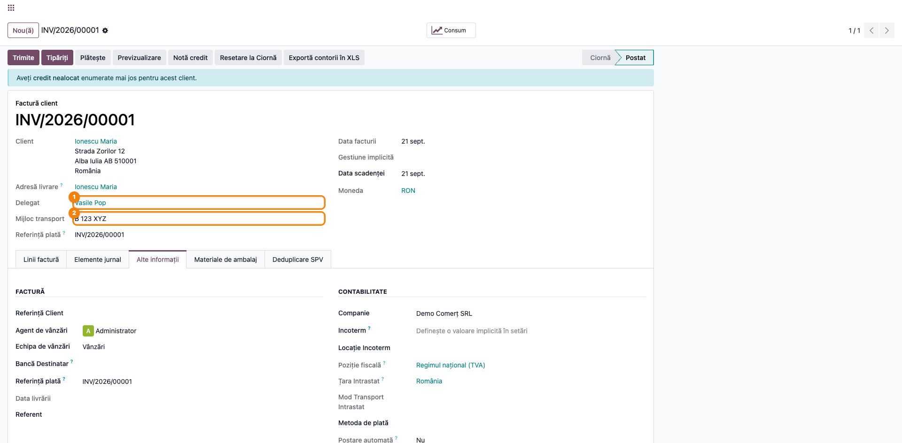
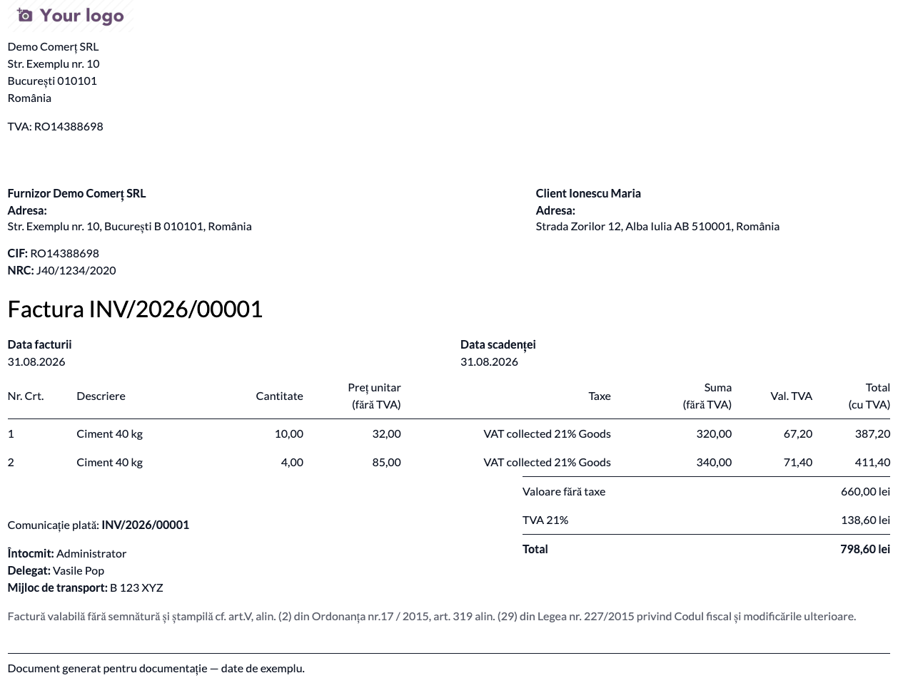
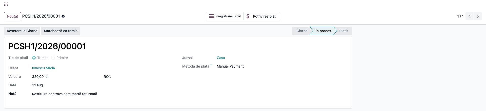
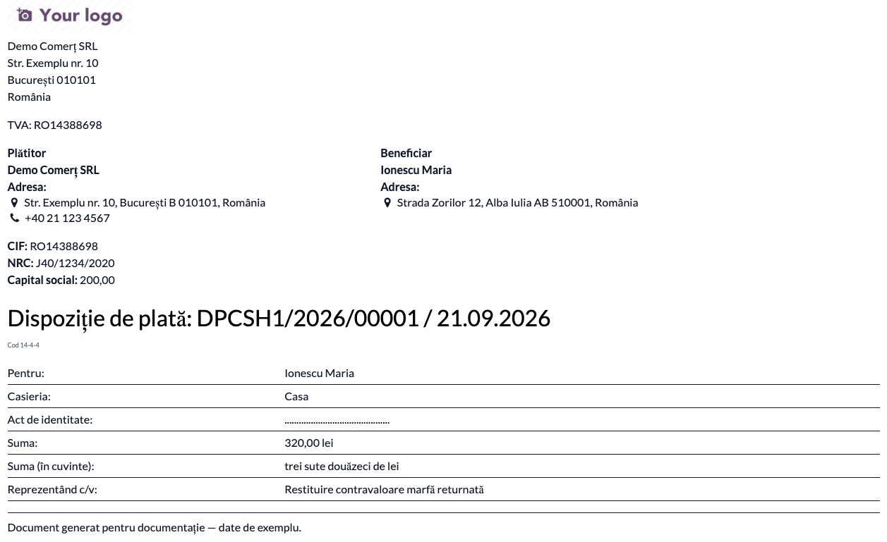
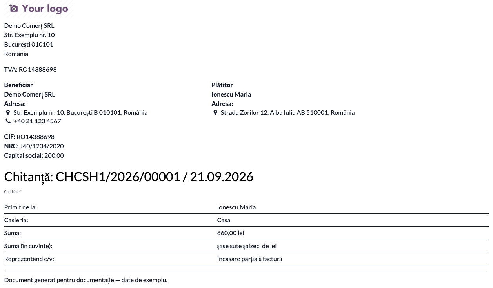

# Fișă Modul: Factura, chitanța și dispoziția de casă în format românesc

**Modul:** `l10n_ro_invoice_report`
**Utilizator principal:** Contabil facturare, operator facturare, casier
**Prioritate:** 🔴 Ridicată (documentele ies la client și la control)

---

## 1. Scop business

Modulul aduce documentele tipărite din Odoo la forma cerută în România. Pe factură adaugă ce lipsește din raportul standard — prețul fără TVA și valoarea TVA pe fiecare linie, numerotarea liniilor, delegatul și mijlocul de transport, mențiunea legală privind scutirea de semnătură și ștampilă — și tipărește factura în limba companiei, indiferent de limba partenerului.

Pe partea de casierie, același modul produce **chitanța și dispoziția de plată/încasare** direct din plată. Pentru plățile pe jurnal de casă, documentul iese ca formular de casierie complet: codul formularului tipizat, casieria, rândul pentru actul de identitate al beneficiarului și cele trei semnături. Fără semnătura beneficiarului, o dispoziție de plată nu justifică ieșirea de numerar din casă.

## 2. Bază legală și context

- **Factura**: art. 319 din Legea 227/2015 (Codul fiscal) — elementele obligatorii ale facturii; mențiunea privind valabilitatea fără semnătură și ștampilă se sprijină pe art. V alin. (2) din OG 17/2015 și pe art. 319 alin. (29) din Codul fiscal.
- **Documentele de casă**: OMFP 2634/2015 privind documentele financiar-contabile — **dispoziția de plată/încasare către casierie, cod 14-4-4**, respectiv **chitanța, cod 14-4-1**. Formularele cer numărul, data, beneficiarul, suma în cifre și în litere, motivul și semnăturile.
- Contextul practic care a produs completarea formularului: la restituirea în numerar a unei mărfi returnate, casieria are nevoie de un document semnat de cel care primește banii. Vezi și modulul de retururi POS, pentru cazurile în care restituirea nu trece printr-o plată contabilă.

## 3. Utilizatori și roluri

Contabil facturare, operator facturare, casier.

Roluri recomandate pentru testare:
- Administrator funcțional: instalează modulul, activează opțiunile de raport în setări;
- Operator facturare: emite factura, completează delegatul și mijlocul de transport, tipărește;
- Casier / contabil: înregistrează plata sau încasarea în numerar și tipărește documentul de casă.

## 4. Conturi și date implicate

Modulul nu generează note contabile — este exclusiv de tipărire. Datele pe care le afișează vin din documentele existente:

- factura de client (`out_invoice`), cu liniile, taxele și cotele aferente (TVA 21% / 11% în 2026);
- plata sau încasarea (`account.payment`) pe **jurnal de casă**, pentru documentele de casierie; pe jurnal de bancă documentul se tipărește fără elementele de casă;
- datele companiei — CIF, NRC, capital social, adresă — și ale partenerului, preluate pe document.

Date minime pentru demo:
- companie românească, cu CIF și adresă completă, iar **limba partenerului companiei setată pe română** (raportul „în limba companiei" o citește de acolo);
- un jurnal de casă cu nume lizibil, care apare pe document ca „Casieria";
- un partener cu adresă completă;
- biblioteca `num2words` instalată, pentru suma în litere (`pip3 install num2words==0.5.12`).

## 5. Configurare inițială

1. Instalați modulul `l10n_ro_invoice_report` pe baza demo.
2. În **Contabilitate → Configurare → Setări**, secțiunea de facturare, activați opțiunile de raport dorite: afișarea delegatului, numerotarea liniilor („Nr. Crt."), totalul cu taxe pe linie, prețul fără discount, vizibilitatea email/telefon în adresă, logoul Coface. Toate sunt per companie.
3. Verificați limba partenerului companiei — de ea depinde limba facturii tipărite.
4. Verificați că jurnalul de casă are un nume potrivit pentru tipărire; el apare ca „Casieria" pe dispoziție și pe chitanță.
5. Emiteți o factură de test și înregistrați o plată în numerar, ca să aveți ambele documente de verificat.

## 6. Flux de utilizare

### Pasul 1 — Completarea delegatului și a mijlocului de transport pe factură

Pe factura de client, în tabul **Alte informații**, completați **Delegat** și **Mijloc transport**. Câmpurile sunt adăugate de acest modul și apar pe documentul tipărit; delegatul se afișează doar dacă opțiunea corespunzătoare e activă în setări.



### Pasul 2 — Tipărirea facturii în limba companiei

Din **Tipăriți**, alegeți raportul **Invoices in company language**. Documentul iese în limba partenerului companiei, indiferent de limba partenerului facturat — util când clientul are altă limbă setată, dar factura trebuie arhivată în română.

**Găsiți pe ecran**, înainte de a trimite documentul mai departe: numerotarea liniilor („Nr. Crt."), prețul unitar și valoarea fără taxe pe fiecare linie, coloana de TVA pe linie („Val. TVA"), blocul de totaluri (valoare fără taxe, TVA pe cotă, total), rândurile **Întocmit**, **Delegat**, **Mijloc de transport** și mențiunea legală de la final.

**Verificați** că: totalul cu taxe corespunde sumei liniilor, cota afișată e cea corectă pentru data facturii, delegatul și mijlocul de transport sunt cele completate la pasul 1, iar întocmitorul e persoana care a emis factura.



### Pasul 3 — Înregistrarea plății în numerar

Înregistrați plata pe **jurnalul de casă**, cu partenerul, suma și motivul completat în **Notă** — motivul apare pe document la rubrica „Reprezentând c/v". Pentru o restituire de marfă returnată, partenerul este persoana care primește banii.



### Pasul 4 — Tipărirea dispoziției de plată către casierie (cod 14-4-4)

Din **Tipăriți → Voucher / Payment** se obține dispoziția de plată.

**Găsiți pe ecran**: titlul „Dispoziție de plată", numărul și data, mențiunea **Cod 14-4-4** sub titlu, blocurile **Plătitor** (compania) și **Beneficiar** (persoana care primește banii), rubricile Casieria, Act de identitate, Suma în cifre și în litere, Reprezentând c/v, apoi cele trei semnături — Conducătorul unității, Casier, Am primit suma.

**Verificați** că: suma în litere corespunde sumei în cifre, casieria e cea din care ies efectiv banii, iar rândul de act de identitate există pentru completare la casă. Documentul se tipărește și se semnează de beneficiar la primirea banilor.



### Pasul 5 — Tipărirea chitanței / dispoziției de încasare (cod 14-4-1)

Pentru o încasare în numerar, același raport produce **chitanța**, cu mențiunea **Cod 14-4-1**, blocurile Furnizor/Client, rubrica „Primit de la" și semnătura „Am depus suma". Rândul de act de identitate nu se tipărește — se cere doar la plată, unde banii ies din casă.



### Note de monografie și raportare

Modulul **nu generează note contabile** — tipărește documente peste înregistrări existente. Notele rămân cele produse de Odoo:

- factura de client: **Dr 4111 = Cr 707/704 + Cr 4427**;
- încasarea în numerar: **Dr 5311 = Cr 4111**;
- plata în numerar către un partener: **Dr 4111/401 = Cr 5311**.

Documentele tipărite sunt justificativele acestor note: factura pentru prima, chitanța (14-4-1) pentru a doua, dispoziția de plată (14-4-4) pentru a treia. Pentru registrul de casă (cod 14-4-7A), dispozițiile și chitanțele sunt anexele pe care le cere contabilitatea la fiecare zi de casă.

## 7. Legături cu alte module / declarații

| Modul / proces | Rol în flux | Tip legătură |
|---|---|---|
| `account` | facturile și plățile peste care se tipăresc documentele | dependență (manifest) |
| `l10n_ro_report_common` | elemente comune de layout pentru rapoartele localizării | dependență (manifest) |
| `sale` / `purchase` | documentele comerciale din care provin facturile | dependență (manifest) |
| `stock_delivery` | livrările și AWB-urile afișate pe factură | dependență (manifest) |
| `l10n_ro_cash_bank_enhanced` | registrul numerotat de dispoziții de casă, pentru mișcările de numerar care **nu** trec printr-o plată contabilă | complementar, fără dependență |
| `l10n_ro_pos_returns` | restituirile de la casa de marcat, care nu produc `account.payment` | complementar, fără dependență |
| `l10n_ro_edi` | transmiterea facturii în SPV; documentul tipărit de aici e pentru arhivă și pentru client | independent |

Ce este automat: alegerea titlului documentului după tipul plății, codul formularului și elementele de casierie pentru jurnalele de casă, suma în litere, limba facturii.
Ce rămâne manual: completarea delegatului și a mijlocului de transport, completarea actului de identitate pe document la casă, semnăturile.

## 8. Verificări pentru consultant

- [ ] Modulul se instalează fără erori și `num2words` este disponibil în mediu.
- [ ] Opțiunile de raport din setări se reflectă pe documentul tipărit (delegat, numerotare linii, total cu taxe).
- [ ] Factura tipărită iese în limba companiei, chiar dacă partenerul are altă limbă.
- [ ] Pe factură apar: Nr. Crt., preț fără TVA pe linie, valoare TVA pe linie, totalurile pe cotă, mențiunea legală.
- [ ] Delegatul și mijlocul de transport completate pe factură apar pe document.
- [ ] Dispoziția de plată pe jurnal de casă are: cod 14-4-4, Plătitor și Beneficiar corect atribuite, casieria, rândul de act de identitate, suma în cifre și în litere, cele trei semnături.
- [ ] Chitanța pe jurnal de casă are cod 14-4-1 și semnătura „Am depus suma", fără rândul de act de identitate.
- [ ] Pentru o plată pe jurnal de **bancă**, documentul se tipărește **fără** cod de formular, casierie și semnături — nu este document de casă.
- [ ] Suma în litere corespunde sumei în cifre, inclusiv la valori cu zecimale.

## 9. Mesaje de eroare frecvente

| Mesaj / simptom | Cauză probabilă | Remediere |
|---|---|---|
| Suma în litere apare goală sau raportul crapă la tipărire | Biblioteca `num2words` nu e instalată în mediul Odoo | `pip3 install num2words==0.5.12` și repornire server |
| Factura tipărită iese în engleză, deși utilizatorul e pe română | Raportul „în limba companiei" citește limba **partenerului companiei**, nu a utilizatorului | Setați limba română pe fișa partenerului companiei |
| Delegatul nu apare pe documentul tipărit | Opțiunea „Afișează delegatul pe factură" e dezactivată în setări | Activați opțiunea în setările de facturare, per companie |
| Dispoziția de plată nu are cod de formular, casierie sau semnături | Plata e pe un jurnal de bancă, nu de casă | Corect — elementele de casierie se tipăresc doar pentru jurnale de casă |
| Rubrica „Casieria" afișează un nume în engleză | Numele jurnalului de casă provine din datele de configurare | Redenumiți jurnalul de casă |
| Numele taxei apare în engleză pe factură (ex. „VAT collected 21% Goods") | Este denumirea taxei din configurare, nu un text traductibil | Redenumiți taxa în planul de conturi al companiei |
| Termeni în engleză rămași pe un document, deși `i18n/ro.po` pare complet | Traducerea există, dar `msgid`-ul nu se mai potrivește cu șablonul: acesta a fost reindentat, iar Odoo aplică traducerile prin potrivire exactă, spațiul alb inclus. Nimic nu semnalează problema | Reexportați `.pot` și resincronizați `ro.po` pe forma curentă a `msgid`-urilor |

## 10. Capturi de ecran

Capturile (`readme/screenshots/`) sunt **generate automat** din `tests/test_screenshots.py` (mixinul `ScreenshotCase` din `l10n_ro_doc_screenshots`, import defensiv), în **limba română**, pe planul de conturi RO:

1. `01_factura_delegat.png` — factura de client, cu Delegat și Mijloc transport evidențiate în tabul „Alte informații".
2. `02_factura_tiparita.png` — factura tipărită în limba companiei, cu numerotarea liniilor, TVA pe linie, întocmitorul, delegatul și mențiunea legală.
3. `03_plata_numerar.png` — plata în numerar înregistrată pe jurnalul de casă.
4. `04_dispozitie_plata.png` — dispoziția de plată către casierie (cod 14-4-4), cu Plătitor/Beneficiar, act de identitate, suma în litere și cele trei semnături.
5. `05_chitanta_incasare.png` — chitanța pentru încasare (cod 14-4-1), cu „Am depus suma".

Regenerare:

```bash
./odoo/odoo-bin -c odoo.conf -d <db> -i l10n_ro_invoice_report,l10n_ro_doc_screenshots \
    --test-tags=fise_screenshots --stop-after-init
```

> Rulați pe o bază **curată**, cu doar aceste module instalate. Pe o bază cu suita completă, randarea ecranelor grele depășește timpul de așteptare al capturii.

> **Notă pentru cine întreține traducerile.** Odoo aplică traducerile de șablon prin potrivire
> **exactă** a `msgid`-ului, inclusiv newline-urile și indentarea din interiorul textului. Dacă
> șablonul e reindentat fără a resincroniza `ro.po`, traducerea rămâne în fișier, corectă ca
> text, dar nu se mai aplică: documentul iese în engleză, iar fișierul pare complet. Verificarea
> utilă e compararea `msgid`-urilor din `.pot`-ul reexportat cu cele din `ro.po`, nu numărarea
> intrărilor care au traducere.

## 11. Observații pentru manual

Păstrați în manual distincția care contează pentru operator: **documentul de casă se tipărește din plată, nu din factură**, iar elementele de formular tipizat (cod, casierie, act de identitate, semnături) apar numai pentru plățile pe jurnal de casă. Pentru restituirile de la casa de marcat, unde nu există o plată contabilă, dispoziția se emite din registrul de dispoziții al modulului de casierie — merită o trimitere explicită, altfel operatorul caută butonul unde nu e.
