# Fișă Modul: NIR, aviz de însoțire, bon de consum și notă de transfer

**Modul:** `l10n_ro_stock_picking_report`
**Utilizator principal:** Gestionar, operator recepție, contabil de gestiune
**Prioritate:** 🔴 Ridicată (documentele justifică încărcarea și descărcarea gestiunii la control)

---

## 1. Scop business

Transferurile de stoc din Odoo se tipăresc standard ca o simplă listă de colectare, fără preț și fără rubricile cerute de formularele românești. Modulul adaugă **nouă rapoarte**. Șapte se tipăresc direct de pe transfer (`stock.picking`): nota de recepție (NIR) în trei variante — cu taxe, fără taxe și cu preț de vânzare — avizul de însoțire a mărfii în două variante (cu și fără prețuri), bonul de consum și nota de transfer intern. Celelalte două sunt **cumulative**: adună pe un singur formular toate mișcările dintr-un interval și se lansează dintr-un meniu separat.

Toate variantele de NIR și nota de transfer trec prin **aceeași funcție de calcul al liniei**. Consecința practică, pentru cine investighează o sumă greșită: dacă valoarea e greșită pe NIR-ul cu taxe, e greșită și pe cel fără taxe, și pe cel cu preț de vânzare, și pe raportul cumulativ — nu are rost căutat separat în fiecare șablon. Diferă doar coloanele afișate.

## 2. Bază legală și context

Baza este **OMFP 2634/2015** privind documentele financiar-contabile (M.Of. 910/09.12.2015; Nomenclatorul și modelele sunt în Anexele 2 și 3, publicate în **M.Of. 910 bis**), care a redus Nomenclatorul la 53 de documente și a transformat majoritatea formularelor în **formulare fără regim special**: formatul grafic nu mai e impus, dar **conținutul minimal rămâne obligatoriu**, iar entitatea poate adapta modelul prin proceduri proprii aprobate de administrator.

Formularele acoperite de acest modul:

| Document tipărit | Cod formular | Servește ca |
|---|---|---|
| Notă de recepție și constatare de diferențe (NIR) | **14-3-1A** | document de recepție a bunurilor aprovizionate; justificativ de **încărcare în gestiune** și de înregistrare în contabilitate |
| Aviz de însoțire a mărfii | **14-3-6A** | document de însoțire a mărfii pe timpul transportului, când factura se emite ulterior |
| Bon de consum | **14-3-4A** (colectiv: 14-3-4/aA) | document de eliberare din magazie; justificativ de **scădere din gestiune** |
| Bon de predare, transfer, restituire | **14-3-3A** | mișcarea între gestiuni în incinta aceleiași unități — rolul acoperit de „nota de transfer" |

Rubricile pe care NIR-ul (14-3-1A) trebuie să le poarte: număr și dată, documentul însoțitor (factură / aviz), comisia de recepție, furnizorul, delegatul și vagon/auto nr., iar în tabel — nr. crt., denumirea bunurilor, U/M, **cantitatea conform documente** și **cantitatea recepționată**, prețul unitar și valoarea; la gestiunile ținute la preț de vânzare, suplimentar prețul și valoarea la preț de vânzare. La subsol: comisia de recepție și rubrica „Primit în gestiune".

⚠️ **Ce nu acoperă raportul din acest modul**, față de lista de mai sus: tipărește **o singură coloană de cantitate** (cea recepționată), fără nr. crt., fără delegat și fără vagon/auto nr. Consecința practică: NIR-ul modulului **nu poate constata diferențe** între cantitatea din documente și cea recepționată — exact cazul pentru care ordinul îl cere obligatoriu. Dacă clientul are recepții cu diferențe, documentul conform este o dezvoltare, nu o configurare.

NIR-ul este **obligatoriu** mai ales la: bunuri din gestiuni diferite pe aceeași factură, bunuri primite spre prelucrare sau în custodie, bunuri de la persoane fizice, bunuri sosite **fără documente**, bunuri cu **diferențe la recepție** și mărfuri în gestiuni ținute la preț de vânzare.

## 3. Utilizatori și roluri

Gestionarul și operatorul de recepție tipăresc documentele; contabilul de gestiune le folosește ca justificativ; consultantul le configurează.

Roluri recomandate pentru testare:
- **Administrator funcțional** — instalează modulul, setează lista de prețuri pe locația de magazin, decide dacă NIR-ul iese cu sau fără coloanele de taxe;
- **Operator stoc** (`stock.group_stock_user`) — validează recepția, completează delegatul și mijlocul de transport, tipărește NIR-ul și avizul;
- **Contabil** — verifică valorile de pe NIR față de factura furnizorului și față de nota contabilă.

Pentru ca unitatea de măsură să se tipărească pe rapoarte, utilizatorul trebuie să aibă activat grupul **Unități de măsură** (`uom.group_uom`); coloana U/M este condiționată de el.

## 4. Conturi și date implicate

Modulul **nu generează note contabile** — tipărește documente peste mișcări de stoc existente. Conturile implicate sunt cele ale notelor produse de modulele de stoc și de achiziții:

- **371 / 301 / 302 / 381** — gestiunea încărcată la recepție;
- **401** (sau **408**, „Furnizori — facturi nesosite", când marfa vine fără factură) — obligația față de furnizor;
- **4426** — TVA deductibilă, din factura furnizorului;
- **601 / 602 / 603 / 6588** — cheltuiala la consum, după natura bunului eliberat din magazie;
- **418** „Clienți — facturi de întocmit" și **4428** „TVA neexigibilă" — pentru livrarea pe aviz, până la emiterea facturii;
- **378 / 4428** — dacă gestiunea e ținută la preț de vânzare cu adaos și TVA neexigibilă.

Date minime pentru demo:
- companie românească, în **RON**, cu CIF și adresă complete (apar în antetul documentelor);
- un depozit cu locație internă și, dacă se demonstrează NIR-ul cu preț de vânzare, o **listă de prețuri** legată de locația de magazin;
- un furnizor și un client cu adresă completă — orașul furnizorului se tipărește în textul de recepție;
- un produs stocabil cu preț de achiziție și preț de vânzare;
- pentru cazul cu unități de ambalare: o unitate de măsură derivată (ex. „Cutie 13 kg") și parametrul `stock.propagate_uom` pe `1`.

## 5. Configurare inițială

1. Instalați modulul `l10n_ro_stock_picking_report`. El exclude `l10n_ro_stock_picking_comment_template` — cele două nu pot coexista.
2. Activați grupul **Unități de măsură** pentru utilizatorii care tipăresc documente (Setări → Utilizatori și companii, sau Inventar → Setări → „Unități de măsură"), altfel coloana U/M lipsește de pe rapoarte.
3. În **Inventar → Configurare → Locații**, deschideți locația de gestiune și completați cele două câmpuri adăugate de modul, în secțiunea *Informații suplimentare*: **Pricelist** — lista de prețuri din care se ia prețul de vânzare afișat pe NIR pentru gestiunile ținute la preț de vânzare — și **Manager**, persoana care apare la rubrica „Primit în gestiune" pe documentele tipărite. Managerul se completează pe **fiecare** gestiune care primește marfă, nu doar pe cea de magazin: unde lipsește, rubrica iese necompletată pe NIR. Cele două etichete apar în engleză, traducerea lor lipsește din `i18n/ro.po`.

   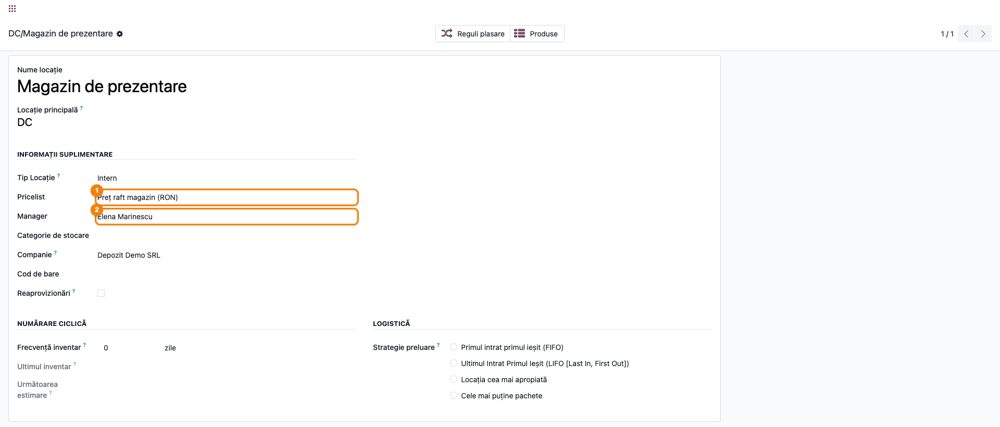

4. **Coloanele de taxe de pe NIR** se comandă din câmpul `taxes_on_reception` de pe companie (implicit **activ**); la fel, afișarea conturilor bancare pe documente, din `banks_on_pickings`. ⚠️ Modulul **nu livrează un ecran de setări** pentru ele: câmpurile `related` există pe `res.config.settings`, dar view-ul lipsește cu totul din modul (linia e comentată în manifest, iar fișierul nu există). Dacă trebuie schimbate, se modifică pe înregistrarea companiei (modul dezvoltator) sau prin date de configurare. Dacă vreți NIR fără taxe pentru un singur document, folosiți raportul dedicat **Recepie fără tva** (denumirea conține o greșeală de tipar în traducere, de corectat în `i18n/ro.po`), nu comutatorul global.
5. **Completați Referința furnizorului pe comanda de achiziție.** Modulul suprascrie documentul sursă al recepției cu referința furnizorului (`models/purchase.py`); dacă aceasta e goală, recepția rămâne fără document sursă, iar pe NIR rubrica legală **„conform documentului nr. ______"** iese necompletată. Referința furnizorului — numărul facturii sau al avizului — este cea care ajunge acolo, nu numărul comenzii de achiziție.
6. Pentru recepțiile în **unități de ambalare** (cutii, baxuri, paleți), verificați parametrul de sistem `stock.propagate_uom`. Pe `1`, mișcarea de stoc păstrează unitatea de pe comanda de achiziție (cutia); implicit (`0`), Odoo o convertește în unitatea de referință a produsului (kg). Parametrul **schimbă felul în care se citesc cifrele de pe NIR** — vezi Pasul 6.
7. Emiteți o comandă de achiziție de test și validați recepția, ca să aveți un document pe care să verificați toate cele trei variante de NIR.

## 6. Flux de utilizare

### Pasul 1 — Validarea recepției și completarea delegatului

Recepția vine din comanda de achiziție: **Achiziții → Comenzi → Comenzi de achiziție**, apoi butonul **Recepție**. Pe formularul transferului, în tabul **Informații suplimentare**, grupul *Alte informații*, modulul adaugă două câmpuri sub responsabil: **Delegat** — persoana care a adus marfa — și **Mijloc transport**. Delegatul se alege dintre persoanele fizice; la selectarea lui, mijlocul de transport se completează automat din fișa delegatului, dacă acesta îl are salvat.

Completați-le **înainte** de validare și apăsați **Validare**. Butonul de tipărire apare doar pe transferurile în stare *Efectuat*.

⚠️ Pe o **recepție**, cele două câmpuri rămân evidență internă: NIR-ul nu are rubrici de delegat și de mijloc de transport. Ele se tipăresc pe **aviz/livrare** (Pasul 7). Completați-le totuși pe recepție dacă documentul furnizorului le menționează — sunt utile la control și rămân pe transfer.

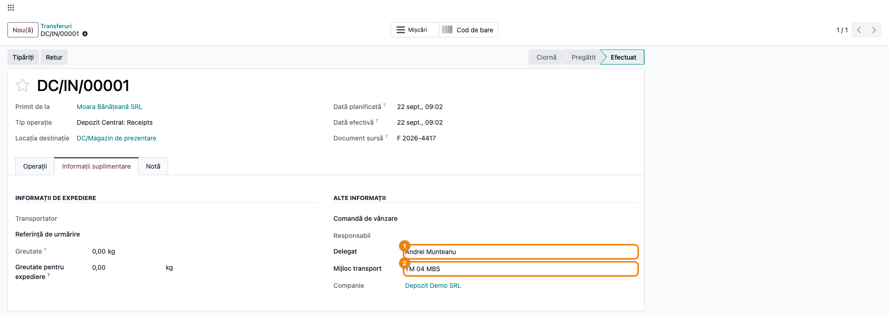

### Pasul 2 — Alegerea documentului de tipărit

Pe transferul validat există **două** căi de tipărire, iar distincția contează:

- butonul **Tipăriți** de pe formular (lângă *Retur*) alege singur raportul, după tipul transferului: recepție → NIR; livrare → aviz; orice altceva → nota de transfer;
- roata dințată **⚙** din breadcrumb, submeniul **Tipăriți**, listează toate rapoartele disponibile pe transfer și lasă alegerea operatorului. Cele șapte ale modulului sunt: **Aviz**, **Aviz cu preț**, **Bon de Consum**, **Recepție (NIR)**, **Recepie fără tva**, **Recepție cu preț de vânzare** și **Notă de Transfer**. Deasupra lor apar rapoartele standard din Odoo (Operații ridicare, Tipărire Livrare, Borderou de returnare, Etichete).

Varianta de NIR **cu preț de vânzare** nu se obține niciodată prin butonul automat: el o alege doar pentru locațiile marcate ca magazin, iar indicatorul respectiv este dezactivat în modul. Deci pentru NIR-ul cu preț de vânzare folosiți întotdeauna submeniul.

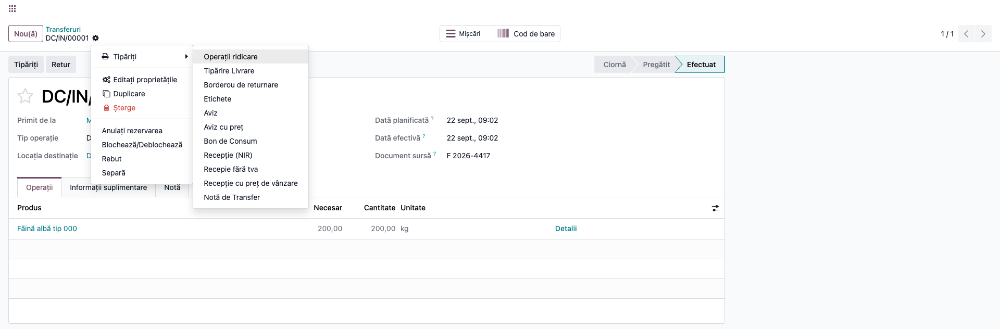

### Pasul 3 — NIR-ul standard (Recepție (NIR), cod 14-3-1A)

**Găsiți pe ecran**, de sus în jos: antetul cu datele companiei și ale furnizorului (CIF, NRC, capital social, adrese); titlul **NIR:** cu numărul transferului și data; blocul **Comanda / Data / În locația** — „Comanda" poartă de fapt Referința furnizorului, nu numărul comenzii de achiziție; textul de recepție — „Subsemnații, membri ai comisiei de recepție, am procedat la recepționarea … furnizate de …"; tabelul cu coloanele **Produs · Cantitate · Preț unitar · Valoare · Taxe · Valoare cu TVA**; totalurile; și, la subsol, rubricile **Comisia de recepție** și **Primit în gestiune**.

**Verificați** că: totalul fără taxe corespunde valorii de pe factura furnizorului; cota de TVA e cea de pe comanda de achiziție, nu cea implicită a produsului; loturile recepționate apar sub denumirea produsului; furnizorul din text e cel real; iar rubrica **„conform documentului nr."** poartă numărul facturii sau al avizului — dacă e goală, lipsește Referința furnizorului de pe comanda de achiziție (vezi pasul 5 din configurare).

**Abia după aceea** tipăriți — meniu **Tipăriți → Recepție (NIR)**. Numele fișierului PDF se compune din tipul operațiunii și numărul transferului.

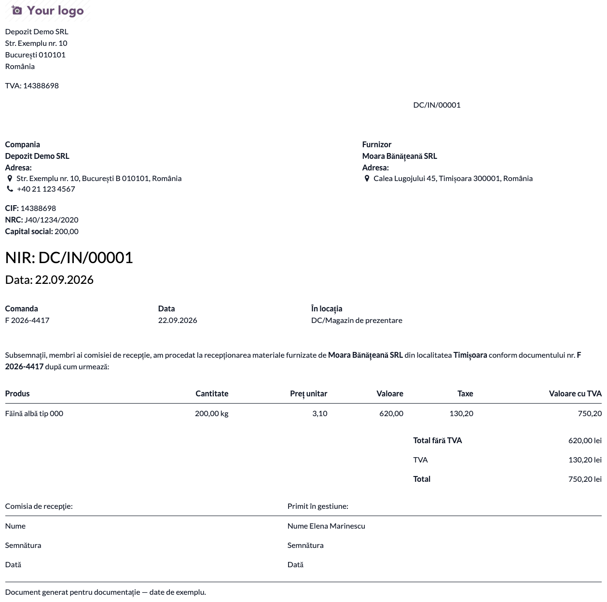

### Pasul 4 — NIR fără taxe

Aceeași notă de recepție, fără coloanele **Taxe** și **Valoare cu TVA** și cu un singur total. Se folosește când documentul merge la gestionar, care nu are de verificat TVA-ul, sau când bunurile nu au taxă deductibilă.

**Verificați** că totalul e identic cu totalul fără taxe de pe NIR-ul complet — este același calcul, doar cu mai puține coloane afișate.

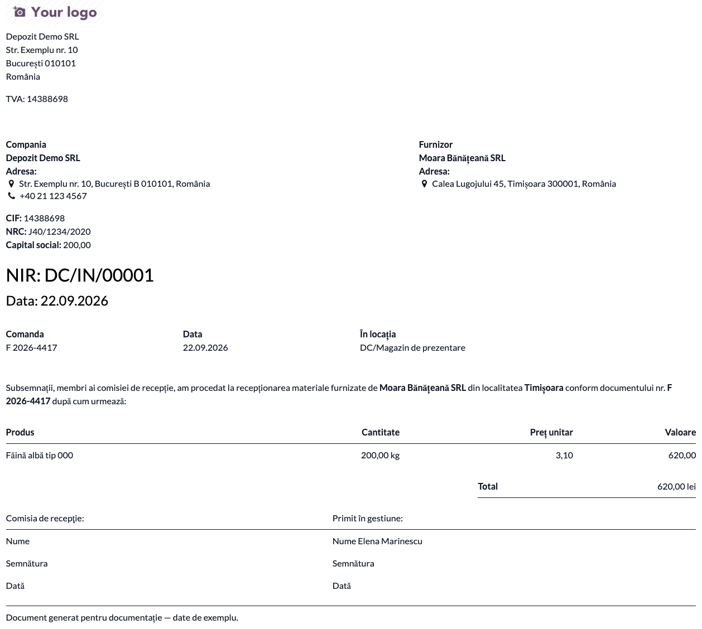

### Pasul 5 — NIR cu preț de vânzare

Varianta pentru gestiunile ținute la preț de vânzare. Adaugă trei coloane: **Preț vânzare**, **Marjă %** și **Valoare vânzare**, plus un al doilea bloc de totaluri la preț de vânzare.

Prețul de vânzare afișat **nu** este cel curent al produsului, ci cel **înghețat la momentul validării recepției**, salvat pe fiecare linie de mișcare. Consecința: dacă mâine schimbați prețul de listă al produsului și retipăriți NIR-ul, documentul iese cu prețul vechi — cel corect, pentru că el a stat la baza adaosului înregistrat atunci. Dacă locația de destinație are o **Listă de prețuri** (Pasul 3 din configurare), prețul înghețat se ia de acolo, nu din prețul de listă.

**Găsiți pe ecran** perechea preț de achiziție / preț de vânzare pe fiecare rând și marja calculată între ele.

⚠️ **Coloana „Valoare vânzare" este cu TVA**, în timp ce „Preț vânzare" este fără. Pe captura de mai jos: 200 kg × 5,90 = 1.180,00 lei fără TVA, iar coloana arată **1.427,80** — adică 1.180,00 + 247,80 TVA. Regula `cantitate × preț = valoare` **nu se aplică** pe blocul de vânzare; pentru el citiți totalurile din dreapta: *Total vânzare fără TVA*, *TVA vânzare*, *Total vânzare*.

**Verificați** că prețul de vânzare e cel valabil la data recepției, nu cel de azi; că provine din lista de prețuri a gestiunii, dacă aceasta are una; și că marja are semn pozitiv acolo unde vă așteptați.

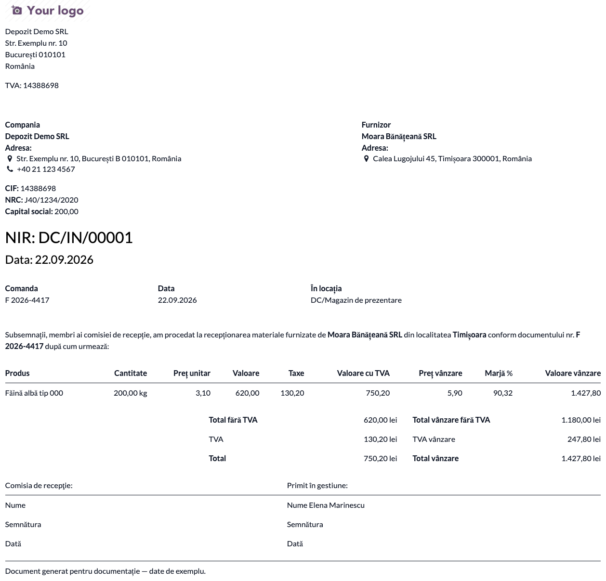

### Pasul 6 — Recepția în unități de ambalare (cutii, baxuri, paleți)

Acesta este pasul pe care merită să îl parcurgeți o dată pe fiecare implementare, pentru că **parametrul de sistem `stock.propagate_uom` schimbă felul în care se citesc cifrele de pe NIR**.

Exemplul de aici: 1.344 de **cutii** a câte 13 kg, la 2,90 lei/kg — adică **37,70 lei cutia**, în total **50.668,80 lei**. Produsul are kilogramul ca unitate de referință, comanda de achiziție e în cutii.

- Cu `stock.propagate_uom = 1`, mișcarea de stoc **păstrează cutia**. Prețul intern al mișcării rămâne însă per kilogram, iar cantitatea din unitatea de referință este de 13 ori mai mare. Raportul convertește prețul în unitatea documentului înainte de orice calcul, astfel încât **fiecare coloană de pe NIR este exprimată în cutii**.
- Cu `stock.propagate_uom = 0` (implicit), Odoo convertește mișcarea în kilograme la confirmarea recepției. NIR-ul iese atunci corect, dar **în kilograme**: 17.472 kg × 2,90 lei. Totalul e același; unitatea de pe document, nu.

Validați recepția ca la Pasul 1.

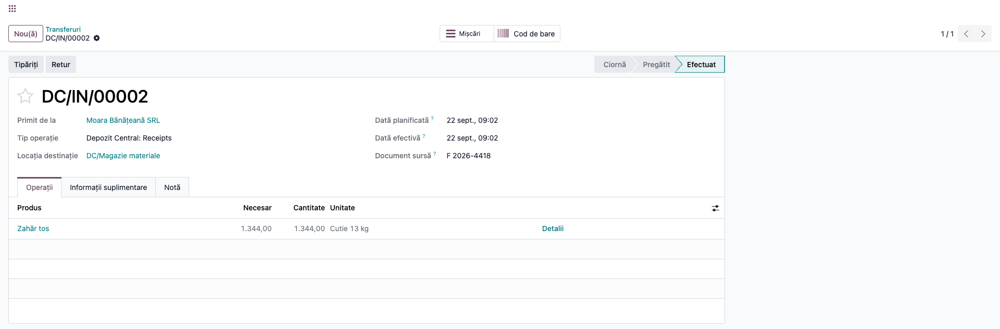

**Găsiți pe ecran**, pe NIR-ul tipărit, rândul produsului și citiți-l în întregime: **Cantitate** în cutii, cu unitatea „Cutie 13 kg" alături; **Preț unitar** per cutie (37,70 lei, nu 2,90); **Valoare** = cantitate × preț unitar.

**Verificați** cu creionul pe document: `cantitate × preț unitar = valoare`. Dacă cele trei numere nu se închid între ele, nu retipăriți raportul — verificați întâi parametrul `stock.propagate_uom` și versiunea modulului. Coerența acestor trei coloane este singura verificare care prinde greșelile de unitate.

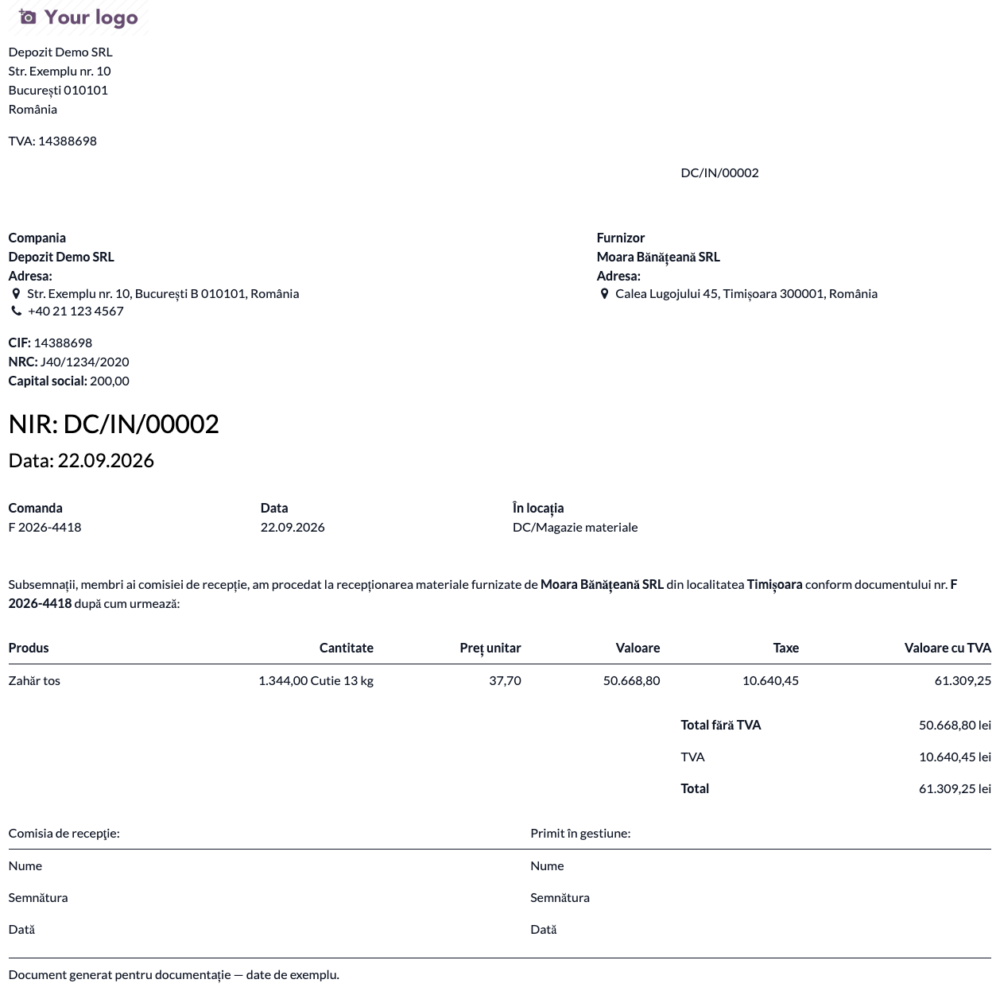

### Pasul 7 — Avizul de însoțire a mărfii (cod 14-3-6A)

Livrarea bifată ca **aviz** se tipărește cu titlul **Aviz de însoțire a mărfii** în loc de „Livrare"; restul documentului rămâne același. Raportul **Aviz cu preț** adaugă coloanele de preț și valoare. Rubricile **Delegat** și **Mijloc de transport** completate la Pasul 1 se tipăresc pe **ambele** variante de aviz — și pe cea simplă, cea pe care o alege butonul automat — și sunt singurele documente ale modulului care le poartă.

Pe livrările **fără comandă de vânzare** — aviz simplu, custodie, consignație — prețul nu poate veni de pe o linie de comandă, așa că raportul îl ia din **lista de prețuri a partenerului**, iar dacă nu găsește acolo, din **prețul de listă** al produsului.

**Verificați** că prețul afișat e cel convenit cu clientul, mai ales pe consignație, unde lista de prețuri a partenerului e singura sursă.

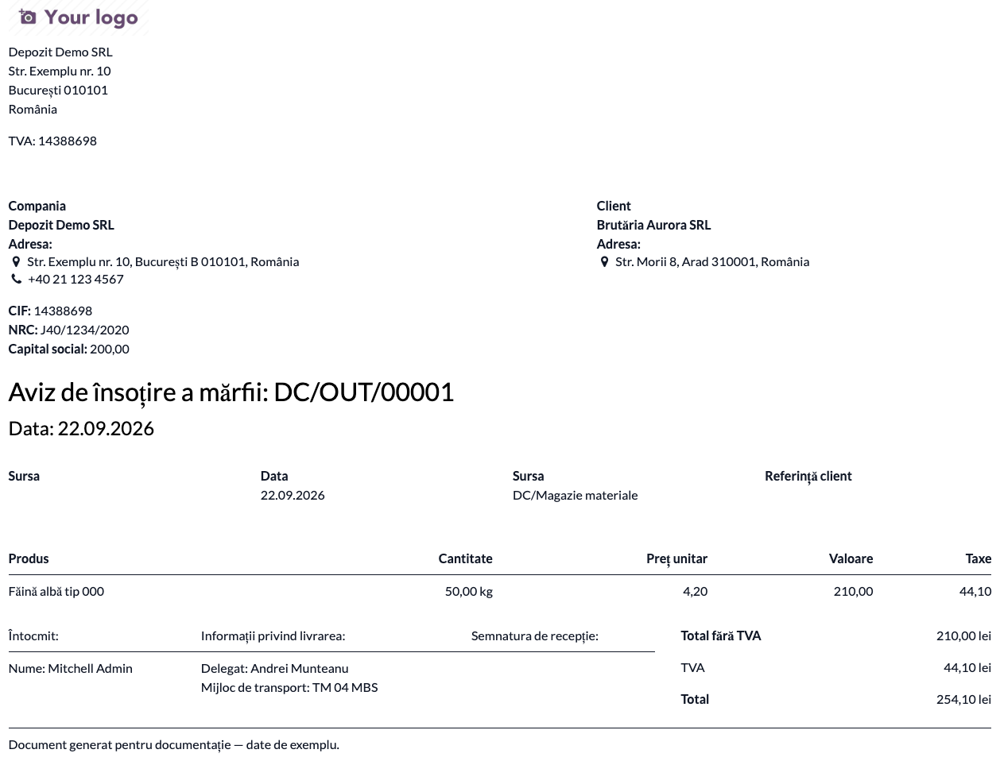

### Pasul 8 — Bonul de consum (cod 14-3-4A)

Pentru eliberarea materialelor din magazie. Documentul poartă titlul **Bon de consum**, numărul și data transferului, blocul sursă / locație de plecare / locație de destinație, tabelul **Produs · Cantitate · Preț unitar · Valoare**, totalul fără taxe și rubrica de semnătură.

⚠️ **Prețul de pe bonul de consum este valoarea de stoc a mișcării împărțită la cantitate** (`move.value`) — nu vine nici din comanda de vânzare, nici din vreo listă de prețuri. Fără o sursă care să scrie în `move.value`, coloana rămâne 0, așa că pe un consum din magazie **Preț unitar și Valoare ies 0,00**, ca în captura de mai jos. Nu încercați să „reparați" asta completând o listă de prețuri: nu e citită aici.

Există o singură sursă care populează `move.value` pentru mișcări interne: **`l10n_ro_stock_account` (OCA, suita `l10n-romania-oca`)**, pe o companie cu planul de conturi RO — raportul citește deja `move.value`, fără nicio modificare aici. **Pachetul CMP al Terrabit (`l10n_ro_stock_pack_cmp` și dependențele lui, suita `l10n_ro_ent`) NU e o astfel de sursă**: `l10n_ro_stock_gestiune` calculează costul transferului doar ca să-și genereze propria notă contabilă (gestiune-destinație = cont de transfer = gestiune-sursă), fără să-l scrie pe mișcare — comentariul din codul lui spune explicit „transferurile interne nu poartă `value` în O19, deci costul se calculează aici". Cu pachetul CMP, bonul de consum și nota de transfer rămân deci 0,00, chiar dacă nota contabilă corectă există în altă parte.

⚠️ **Nu instalați `l10n_ro_stock_account` doar ca să reparați asta**, dacă clientul are deja pachetul CMP: cele două nu sunt gândite să coexiste — `l10n_ro_stock_gestiune` dezactivează automat view-ul de picking din OCA la instalare (avertisment explicit în `CONFIGURE.md`: „recomandarea rămâne ca cele două module să NU fie instalate împreună"). Fără nicio sursă de valorizare, documentul rămâne valabil ca dovadă a mișcării cantitative; pentru partea valorică se folosește nota contabilă de descărcare/transfer generată de modulul de gestiune instalat.

⚠️ Bonul de consum tipărește la subsol rubrica **„Comisia de recepție"**, moștenită de la NIR. Formularul 14-3-4A cere în schimb *Șef compartiment · Gestionar · Primitor*, plus cantitatea necesară și cea eliberată în coloane separate. Dacă clientul cere formularul conform, este o dezvoltare.

**Verificați** că locația de plecare e magazia reală și că cantitatea eliberată e cea efectivă.

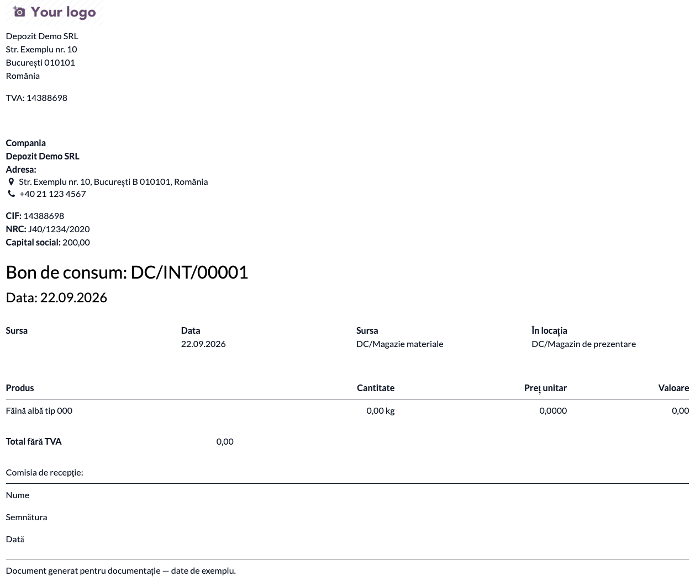

### Pasul 9 — Nota de transfer intern

Pentru mișcările între gestiuni. Titlul documentului este **numele tipului de operațiune** urmat de numărul transferului — deci apare așa cum e denumit tipul de operațiune în baza clientului („Internal Transfers", dacă nu a fost redenumit). Sub el: **Sursa** și **Destinația** ca blocuri distincte, apoi tabelul cu produs, cantitate, preț și valoare, și rubricile de predare/recepție, unde la „Primit" apare *Manager*-ul locației de destinație. Codul de bare din colțul dreapta-sus identifică transferul la scanare — nota de transfer este singurul raport al modulului care îl are. Șablonul prevede și coloane de preț/valoare de vânzare pentru locațiile marcate ca magazin, dar indicatorul respectiv este dezactivat în modul (același motiv ca la Pasul 2), deci **aceste coloane nu apar niciodată**.

⚠️ La fel ca la bonul de consum, **coloanele valorice ies 0,00 pe transferurile interne** fără o sursă de valorizare — prețul se obține din valoarea mișcării împărțită la cantitate (`move.value`), iar Odoo 19 core nu valorizează mișcările care nu intră și nu ies din patrimoniu. Singura sursă care scrie `move.value` este `l10n_ro_stock_account` (OCA); pachetul CMP al Terrabit **nu** o face, deși postează propria notă de transfer (vezi Pasul 8). Fără vreuna dintre ele, nota de transfer este un document cantitativ.

**Verificați** că sursa și destinația sunt gestiunile reale și că tipul de operațiune are un nume lizibil în română — el devine titlul documentului.

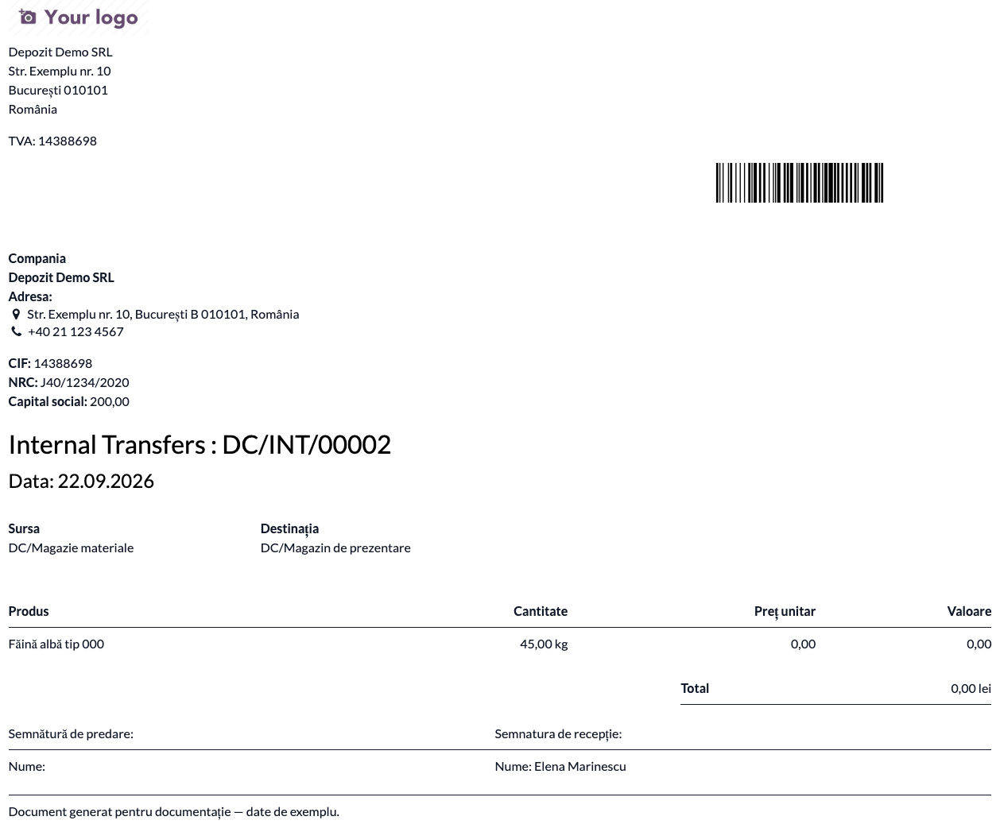

### Pasul 10 — Rapoartele cumulative

Când trebuie un singur formular pentru toate mișcările dintr-o perioadă — de exemplu toate recepțiile dintr-o lună, pentru un dosar — folosiți **Inventar → Raportare → Picking cumulative Report**.

Completați în dialog: **Picking Type** (tipul de operațiune — recepție, transfer intern etc.), **Report** — una dintre cele două variante cumulative — și intervalul **Start Date / Data finală**, care vine implicit pe luna curentă. Etichetele ecranului sunt în engleză — titlul dialogului și numele meniului (**Picking cumulative Report**), câmpurile și numele celor două rapoarte (**Cumulative Reception with sale price**, **Cumulative Internal transfer**): traducerile lipsesc din `i18n/ro.po`.

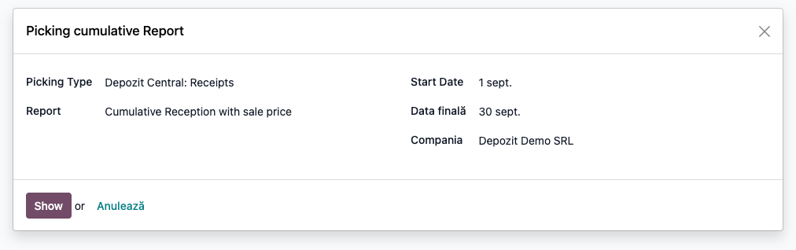

**Găsiți pe ecran**, pe documentul generat: toate mișcările **efectuate** din intervalul ales, pentru tipul de operațiune selectat, pe un singur tabel, cu aceleași coloane ca varianta pe document. Documentul cumulativ **nu are număr propriu și nu are furnizor** — titlul rămâne „NIR:" fără număr, iar textul comisiei de recepție nu numește niciun furnizor, pentru că raportul adună mișcări de la parteneri diferiți.

**Verificați** înainte de a-l arhiva că: intervalul acoperă exact perioada dorită; apar doar mișcările în stare *Efectuat*; numărul de rânduri corespunde numărului de transferuri din perioadă. Butonul **Show** generează direct documentul — nu există o listă intermediară de verificat, deci verificarea se face pe document.

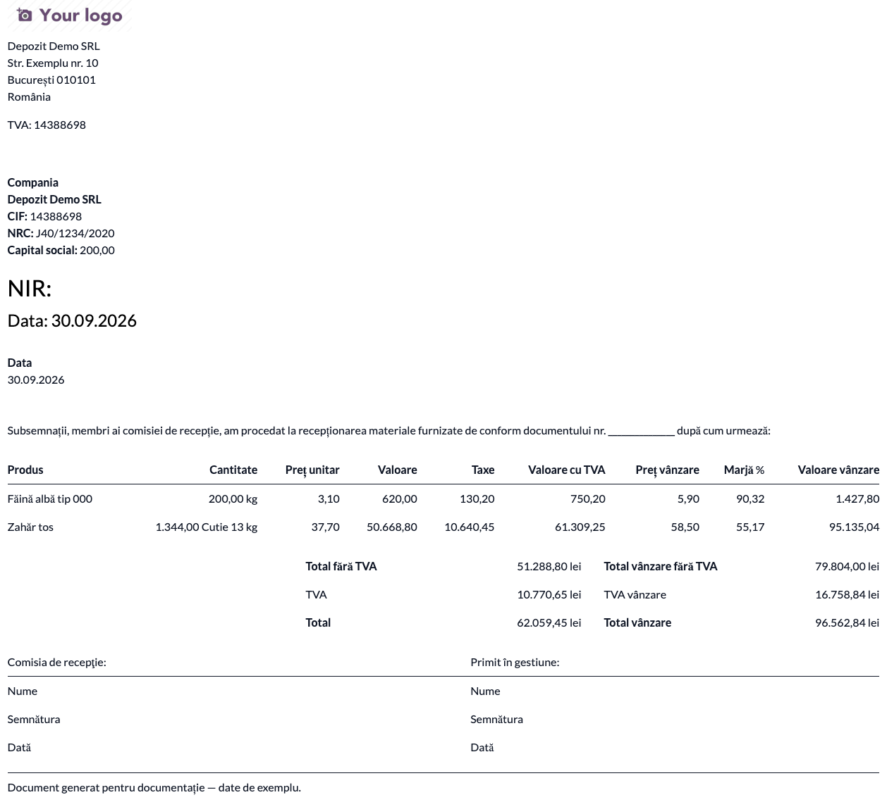

### Note de monografie și raportare

Modulul **nu generează note contabile**. Documentele pe care le tipărește sunt justificativele notelor produse de modulele de stoc, achiziții și vânzări:

- **recepția de la furnizor** — Dr 371/301/302 = Cr 401 (sau Cr 408 când marfa sosește fără factură, urmată de Dr 408 = Cr 401 la primirea facturii); TVA-ul deductibil, Dr 4426, vine cu factura, nu cu NIR-ul. **NIR-ul (14-3-1A) este justificativul încărcării gestiunii**;
- **gestiune la preț de vânzare** — la aceeași intrare se înregistrează suplimentar adaosul comercial, Cr 378, și TVA-ul neexigibil, Cr 4428. Atenție la ce se ia din NIR: **adaosul = Total vânzare fără TVA − Total fără TVA** (în exemplul din fișă, 1.180,00 − 620,00 = **560,00**), iar **Cr 4428 = TVA vânzare** (247,80). Coloana „Valoare vânzare" de pe linie este cu TVA și **nu** este baza adaosului;
- **consumul din magazie** — Dr 601/602/603 = Cr 301/302/303, după natura bunului. **Bonul de consum (14-3-4A) este justificativul descărcării**;
- **transferul între gestiuni** — Dr 371.gestiune-primitoare = Cr 371.gestiune-predătoare, la costul din evidență. Justificativul este bonul de predare-transfer-restituire (14-3-3A), rolul acoperit de nota de transfer;
- **livrarea pe aviz** — Dr 418 = Cr 701/707 și Cr 4428, plus descărcarea Dr 607 = Cr 371; la emiterea facturii, Dr 4111 = Cr 418 și Dr 4428 = Cr 4427. **Avizul (14-3-6A) justifică ieșirea până la facturare**.

Niciunul dintre aceste documente nu intră direct într-o declarație ANAF; ele sunt justificative de gestiune, cerute la control și la inventariere.

## 7. Legături cu alte module / declarații

| Modul / proces | Rol în flux | Tip legătură |
|---|---|---|
| `stock` | transferurile peste care se tipăresc documentele | dependență (manifest) |
| `purchase_stock` | comanda de achiziție, sursa prețului și a taxelor de pe NIR | dependență (manifest) |
| `sale_stock` | comanda de vânzare, sursa prețului de pe aviz | dependență (manifest) |
| `l10n_ro_stock` | indicatorul de aviz, care schimbă titlul documentului de livrare | dependență (manifest) |
| `l10n_ro_invoice_report` | tipărește delegatul și mijlocul de transport pe factură | dependență (manifest) |
| `l10n_ro_report_common` | elementele comune de layout ale rapoartelor localizării | dependență (manifest) |
| `delivery` | transportatorul afișat pe documentele de livrare | dependență (manifest) |
| `l10n_ro_stock_picking_comment_template` | variantă alternativă de rapoarte | **incompatibil** — declarat în `excludes` |
| `deltatech_cmr_document` | documentul CMR pentru transportul internațional | complementar, fără dependență |
| `l10n_ro_stock_account` (OCA, suita `l10n-romania-oca`) | dacă e instalat și compania e pe planul de conturi RO, valorizează mișcările interne — bonul de consum și nota de transfer arată automat prețul și valoarea reale. **Nu se instalează împreună cu pachetul CMP** (`l10n_ro_stock_gestiune` îi dezactivează automat view-ul de picking) | complementar, fără dependență, incompatibil cu pachetul CMP |
| `l10n_ro_stock_pack_cmp` / `l10n_ro_stock_gestiune` (Terrabit, suita `l10n_ro_ent`) | valorizează transferurile pe cont propriu, cu notă contabilă separată (gestiune→gestiune prin cont de transfer) — dar **nu** scrie în `move.value`, deci bonul de consum și nota de transfer rămân 0,00 chiar dacă nota contabilă corectă există | complementar, fără dependență |

**Ce este automat:** alegerea titlului documentului după tipul transferului și după indicatorul de aviz; înghețarea prețului de vânzare la validarea recepției; preluarea mijlocului de transport din fișa delegatului; conversia prețurilor în unitatea de pe document; preluarea referinței furnizorului ca document sursă al recepției.

**Ce rămâne manual:** completarea Referinței furnizorului pe comanda de achiziție; completarea delegatului și a mijlocului de transport pe transfer; alegerea variantei de NIR din submeniul de tipărire; completarea comisiei de recepție și a semnăturilor pe exemplarul tipărit; setarea listei de prețuri și a Managerului pe locațiile de gestiune; decizia asupra parametrului `stock.propagate_uom`.

**Ce nu mai funcționează:** preluarea automată a delegatului și a mijlocului de transport pe factura emisă din livrare. Ea trece prin `_get_invoice_vals`, o metodă care nu mai există în nucleul Odoo 19 — codul a rămas, dar nu se mai apelează. Pe factură, cele două câmpuri se completează manual.

## 8. Verificări pentru consultant

- [ ] Modulul se instalează fără erori, iar `l10n_ro_stock_picking_comment_template` **nu** este instalat în aceeași bază.
- [ ] Utilizatorii care tipăresc au grupul **Unități de măsură** activ — altfel coloana U/M lipsește de pe toate rapoartele.
- [ ] Submeniul **⚙ → Tipăriți** de pe un transfer validat listează toate cele șapte rapoarte ale modulului (Aviz, Aviz cu preț, Bon de Consum, Recepție (NIR), Recepie fără tva, Recepție cu preț de vânzare, Notă de Transfer).
- [ ] Butonul **Tipăriți** de pe formular alege NIR-ul pe recepții, avizul pe livrări și nota de transfer pe restul; NIR-ul cu preț de vânzare se obține **doar** din submeniu.
- [ ] Pe NIR apar: titlul cu numărul transferului, textul comisiei de recepție cu numele furnizorului, **numărul documentului însoțitor** la „conform documentului nr.", tabelul complet și rubricile de subsol „Comisia de recepție" și „Primit în gestiune", cu numele Managerului gestiunii.
- [ ] I-ați spus clientului că NIR-ul modulului are **o singură coloană de cantitate** — deci nu poate consemna diferențe de recepție în sensul formularului 14-3-1A.
- [ ] Totalul fără taxe de pe NIR corespunde valorii de pe factura furnizorului.
- [ ] NIR-ul fără taxe dă **același** total fără taxe ca varianta completă.
- [ ] **Pe o recepție cu unitate de ambalare** (ex. cutie de 13 kg), pe NIR se închide relația `cantitate × preț unitar = valoare`: cantitatea e în cutii, prețul unitar e per cutie (37,70 lei, nu 2,90), iar valoarea e produsul lor. Verificarea se face pe document, cu creionul, nu pe ecranul transferului.
- [ ] Pe aceeași recepție, coloana **Preț vânzare** de pe NIR-ul cu preț de vânzare este exprimată tot **per cutie** — comparabilă cu prețul unitar de pe același rând.
- [ ] Testul făcut o dată pe implementare: schimbați prețul de listă al produsului după validarea recepției și retipăriți NIR-ul cu preț de vânzare — trebuie să iasă prețul **vechi**, cel de la recepție.
- [ ] Dacă locația de destinație are **Pricelist**, prețul de vânzare de pe NIR provine de acolo, nu din prețul de listă al produsului.
- [ ] Ați verificat că nimeni nu folosește coloana „Valoare vânzare" ca bază a adaosului: ea e cu TVA, adaosul se ia ca *Total vânzare fără TVA − Total fără TVA*.
- [ ] Livrarea marcată ca aviz se tipărește cu titlul **Aviz de însoțire a mărfii**; livrarea obișnuită, cu „Livrare".
- [ ] Pe o livrare **fără** comandă de vânzare, raportul **Aviz cu preț** afișează prețul din lista de prețuri a partenerului, iar în lipsa ei prețul de listă al produsului.
- [ ] Nota de transfer afișează sursa și destinația, iar titlul poartă numele tipului de operațiune — verificați că acesta e denumit lizibil în română.
- [ ] Ați spus clientului, înainte de semnarea procesului-verbal, că **bonul de consum și nota de transfer ies cu 0,00 pe coloanele valorice** la mișcările interne. Dacă i se cer documente valorice de consum/transfer, este o dezvoltare, nu o configurare.
- [ ] Recepția într-o locație care are **Pricelist** completat se validează fără eroare (până în 19.0.1.3.5 cădea cu `TypeError` la validare și la tipărire).
- [ ] Raportul cumulativ conține doar mișcările **efectuate** din intervalul ales, pentru tipul de operațiune selectat.
- [ ] Documentele ies în limba română, cu antetul companiei complet (CIF, adresă) — antetul se citește de pe partenerul companiei.

## 9. Mesaje de eroare frecvente

| Mesaj / simptom | Cauză probabilă | Remediere |
|---|---|---|
| Butonul **Tipăriți** nu apare pe transfer | Butonul e vizibil doar în starea *Efectuat* | Validați transferul |
| Un document iese cu valoarea de *factorul unității* ori mai mică sau mai mare, deși prețul unitar e corect | Versiune de modul veche, pe o bază cu `stock.propagate_uom = 1`: prețul și cantitatea erau în unități diferite. Recepțiile și transferurile sunt reparate din 19.0.1.3.4, avizul din 19.0.1.3.6 | Actualizați modulul la 19.0.1.3.6 sau mai nou |
| Pe NIR, `cantitate × preț unitar` nu dă valoarea afișată | Aceeași familie de erori, pe coloana de cantitate sau pe cea de preț de vânzare (rezolvată în 19.0.1.3.4) | Actualizați modulul; verificați și `stock.propagate_uom` |
| Rubrica „conform documentului nr." iese necompletată pe NIR | Comanda de achiziție nu are Referință furnizor; modulul suprascrie documentul sursă al recepției cu ea | Completați Referința furnizorului (nr. facturii/avizului) pe comanda de achiziție, înainte de recepție |
| NIR-ul nu are coloană de „cantitate conform documente", deci nu se pot consemna diferențe | Raportul tipărește o singură coloană de cantitate | Limitare a modulului față de 14-3-1A; documentul de constatare a diferențelor e o dezvoltare |
| Unitatea de măsură lipsește de pe toate rapoartele | Utilizatorul nu are grupul `uom.group_uom` | Activați grupul Unități de măsură |
| Coloanele de taxe nu apar pe NIR, deși produsul are TVA | `taxes_on_reception` e dezactivat pe companie | Reactivați-l pe înregistrarea companiei; modulul nu livrează un ecran de setări pentru el |
| Butonul **Tipăriți** nu scoate niciodată NIR-ul cu preț de vânzare | Indicatorul „locație de magazin" este dezactivat în modul, deci ramura respectivă nu se activează | Folosiți meniul **Tipăriți → Recepție cu preț de vânzare** |
| Prețul de vânzare de pe NIR nu se potrivește cu prețul curent al produsului | Corect — prețul e înghețat la momentul validării recepției | Nimic de remediat; pentru prețul curent folosiți fișa produsului |
| Prețul de vânzare de pe NIR e 0 | Recepția a fost validată înainte de instalarea modulului, deci prețul nu s-a înghețat | Prețul nu se poate reconstitui retroactiv; se completează manual pe mișcare |
| Validarea recepției sau tipărirea NIR-ului crapă cu `TypeError: _compute_price_rule() takes 3 positional arguments but 4 were given` | Versiune anterioară lui 19.0.1.3.5, cu o locație de destinație care are **Pricelist** completat: apelul folosea semnătura veche a listei de prețuri | Actualizați modulul la 19.0.1.3.5; provizoriu, goliți Pricelist de pe locație |
| Bonul de consum sau nota de transfer ies cu **0,00** la Preț unitar și Valoare | Ambele citesc valoarea de stoc a mișcării (`move.value`), dar niciun modul instalat nu scrie în ea. Odoo 19 core nu o face; nici pachetul CMP al Terrabit — valorizează transferul doar pentru propria notă contabilă, fără să scrie pe mișcare | Comportament normal fără sursă de cost, nu o limitare a acestui modul — completarea unei liste de prețuri nu ajută. **Doar** `l10n_ro_stock_account` (OCA) scrie `move.value`; raportul îl citește deja, fără nicio modificare de cod aici — dar nu-l instalați dacă există deja pachetul CMP, cele două nu sunt compatibile |
| „Valoare vânzare" de pe NIR nu e egal cu cantitate × preț de vânzare | Coloana e cu TVA, prețul de vânzare e fără | Comportament corect; folosiți totalurile *Total vânzare fără TVA* / *TVA vânzare* |
| Etichetele „Pricelist", „Manager", „Picking Type", „Report", „Start Date", „Show", „Picking cumulative Report", „Cumulative Reception with sale price" apar în engleză | Traducerile lipsesc din `i18n/ro.po` | Completați traducerea sau redenumiți în baza clientului |
| Raportul de transfer intern crapă cu `ZeroDivisionError` | Versiune anterioară lui 19.0.1.3.1, pe o mișcare fără cantitate cerută | Actualizați modulul |
| NIR-ul crapă cu `AttributeError: 'stock.picking' object has no attribute 'group_id'` | Versiune anterioară lui 19.0.1.2.10 pe Odoo 19, unde `group_id` a fost înlocuit de `reference_ids` | Actualizați modulul |
| Titlul documentului tipărit rămâne „Livrare" deși e aviz | Livrarea nu e bifată ca aviz — „Aviz" e doar numele raportului din meniu, nu titlul de pe hârtie. Câmpul e declarat chiar în acest modul, deci există întotdeauna — nu e o problemă de module lipsă | Bifați indicatorul de aviz pe livrare |
| Pe raportul cumulativ nu apare nicio linie | Filtrul ia doar mișcările în stare *Efectuat*, din intervalul și tipul de operațiune alese | Lărgiți intervalul sau verificați tipul de operațiune |
| Titlul notei de transfer e în engleză (ex. „Internal Transfers") | Titlul tipărește numele tipului de operațiune, care e dată de configurare, nu text traductibil | Redenumiți tipul de operațiune în baza clientului |
| Documentul cumulativ nu are număr și nu numește niciun furnizor | Raportul adună mișcări de la parteneri diferiți, deci nu are un document sursă unic | Comportament normal; numerotarea dosarului se face în afara Odoo |

## 10. Capturi de ecran

Capturile (`readme/screenshots/`) sunt **generate automat** din `tests/test_screenshots.py` (mixinul `ScreenshotCase` din `l10n_ro_doc_screenshots`, import defensiv), în **limba română**, pe planul de conturi RO, pe o companie în RON:

1. `01_locatie_pret_vanzare.png` — locația de gestiune, cu **Pricelist** și **Manager** evidențiate.
2. `02_receptie_delegat.png` — recepția validată, cu **Delegat** și **Mijloc transport** evidențiate.
3. `03_meniu_tiparire.png` — submeniul **⚙ → Tipăriți** deschis, cu cele șapte rapoarte ale modulului.
4. `04_nir.png` — NIR-ul tipărit (cod 14-3-1A), cu toate coloanele și rubricile de semnătură.
5. `05_nir_fara_taxe.png` — NIR fără coloanele de taxe.
6. `06_nir_pret_vanzare.png` — NIR cu preț de vânzare, marjă și totaluri la preț de vânzare.
7. `07_receptie_cutii.png` — recepția în cutii de 13 kg, pe formularul transferului.
8. `08_nir_unitate_ambalare.png` — NIR pe recepția în unități de ambalare: cantitate, preț unitar și valoare, toate pe cutie.
9. `09_aviz_insotire.png` — avizul de însoțire a mărfii (cod 14-3-6A), cu prețuri și valori.
10. `10_bon_consum.png` — bonul de consum (cod 14-3-4A) pe un consum intern, cu coloanele valorice la 0,00.
11. `11_transfer_intern.png` — nota de transfer intern, cu sursa, destinația și rubricile de predare/recepție.
12. `12_wizard_cumulativ.png` — dialogul raportului cumulativ.
13. `13_receptie_cumulativa.png` — recepția cumulativă cu preț de vânzare.

Regenerare — **restrângeți la clasă**, altfel se rescriu capturile tuturor modulelor care au un test de fișe:

```bash
./odoo/odoo-bin -c odoo.conf -d <db> -i l10n_ro_stock_picking_report,l10n_ro_doc_screenshots \
    --test-tags=/l10n_ro_stock_picking_report:TestPickingReportScreenshots --stop-after-init
```

> Rulați pe o bază **curată**, cu doar aceste module instalate. Pe o bază cu suita completă, randarea ecranelor grele depășește timpul de așteptare al capturii.

## 11. Observații pentru manual

Patru lucruri merită păstrate explicit în manualul de utilizare, pentru că fără ele operatorul caută unde nu e:

1. **Butonul de tipărire nu e același lucru cu meniul de tipărire.** Butonul alege un singur raport, după tipul transferului; cele șapte rapoarte sunt în meniu. NIR-ul cu preț de vânzare se obține numai din meniu.
2. **Prețul de vânzare de pe NIR este cel de la data recepției, nu cel de azi.** Este o decizie intenționată, nu o eroare: adaosul înregistrat atunci s-a calculat pe prețul de atunci. Merită o frază în manual, altfel primul gestionar care retipărește un NIR vechi deschide un tichet.
3. **Unitatea de pe NIR este unitatea de pe document.** Dacă recepția s-a făcut în cutii, toate coloanele — cantitate, preț unitar, valoare, preț de vânzare — sunt pe cutie. Verificarea pe care o poate face oricine, fără să știe nimic despre configurare, este că **Cantitate × Preț unitar = Valoare**. Atenție: regula se oprește aici — coloana „Valoare vânzare" este cu TVA și nu se verifică așa.
4. **Bonul de consum și nota de transfer sunt, azi, documente cantitative.** Coloanele de preț și valoare ies 0,00 la mișcările interne. Merită spus în manual la locul lor, nu lăsat să fie descoperit de gestionar la prima tipărire.

Pentru cine întreține modulul: toate variantele de NIR și nota de transfer trec prin aceeași funcție de calcul al liniei (`_get_line` din `report/picking.py`), iar totalurile prin `_get_totals`. O sumă greșită pe una dintre ele e greșită pe toate — se caută acolo, nu în șabloane.
